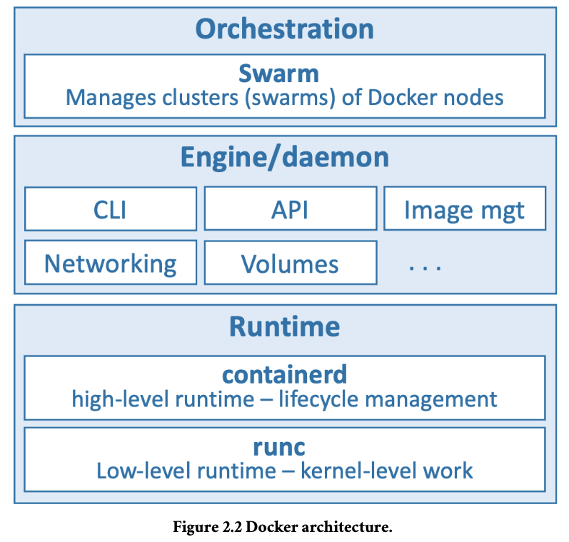

## VMachine

runs multiple business applications safely on a single server.

### Flaws

- every VM requires its own dedicated operating system (OS) as every OS consumes CPU, RAM.
- VMs are slow to boot, and portability isn’t
  great — migrating and moving VM workloads between hypervisors and cloud platforms
  is harder than it needs to be.

## Containers

analogous to the VM. A major differ-
ence is that containers do not require their own full-blown OS

## Kubernetes

is the most popular tool for deploying and managing containerized apps.

```note
A containerized app is an application running as a container.
```

Kubernetes used to use Docker as its default container runtime – the low-level technology
that pulls images and starts and stops containers.

`CRI`- Container Runtime Interface

`Containerd`- is the small specialized part of Docker that does the low-level
tasks of starting and stopping containers.

## Summary

We used to live in a world where every time the business needed a new application we
had to buy a brand-new server. VMware came along and allowed us to drive more value
out of new and existing IT assets. As good as VMware and the VM model is, it’s not
perfect. Following the success of VMware and hypervisors came a newer more efficient
and portable virtualization technology called containers. But containers were initially
hard to implement and were only found in the data centers of web giants that had Linux
kernel engineers on staff. Docker came along and made containers easy and accessible to
the masses.

##2. Docker

Docker is software that runs on Linux and Windows. It creates, manages, and can even
orchestrate containers.

built from various tools from the
`Moby` open-source project

Docker, Inc - company started out as a platform as a service (PaaS) provider called `dotCloud`

“Docker” comes from a British expression
meaning dock worker — somebody who loads and unloads cargo from ships.

Three things to be aware of when referring to
Docker as a technology:

- The runtime
- The daemon (a.k.a. engine)
- The orchestrator



#### Runtime

operates at the lowest level and is responsible for starting and stopping
containers

Docker implements a tiered runtime architecture with high-level and low-
level runtimes that work together.

`RUNC` : The low-level runtime and is the reference implementation of Open Containers Initiative (OCI) runtime-spec.Its job is to interface with the underlying OS and start and stop containers. Every container on a Docker node was created and started
by an instance of runc.

`Containerd`: The higher-level runtime.This manages the entire container lifecycle including pulling images and managing runc instances.

A typical Docker installation has a single long-running containerd process instructing
runc to start and stop containers. runc is never a long-running process and exits as soon
as a container is started.

### Docker daemon (dockerd)

its above containerd and performs higher-level tasks
such as exposing the Docker API, managing images, managing volumes, managing
networks, and more

A major job of the Docker daemon is to provide an easy-to-use standard interface that
abstracts the lower levels.

### Orchestration

Docker also has native support for managing clusters of nodes running Docker. These clusters are called swarms

### The Open Container Initiative (OCI)

The OCI is a governance council responsible for standardizing the low-level fundamen-
tal components of container infrastructure. In particular it focusses on image format and
container runtime

### 3.Installing Docker

Ways to install Docker

- Docker Desktop
  - Windows
  - MacOS
- Multipass
- Server installs on
  - Linux
- Play with Docker

### Docker Desktop

is a desktop app from Docker, Inc. that makes it super-easy to work
with containers.

After installing,it includes Docker Compose and you can even enable a
single-node Kubernetes cluster if you need to learn Kubernetes.

Docker Desktop on Windows can run native Windows containers as well as Linux
containers. Docker Desktop on Mac and Linux can only run Linux containers.

$ docker version shows OS/Arch: linux/amd64 for the Server component. This is
because a default installation assumes you’ll be working with `Linux containers`.

switch to Windows containers by right-clicking the Docker whale icon in
the Windows notifications tray and selecting Switch to Windows containers....

**Docker Desktop on Mac
installs all of the Docker engine components in a lightweight Linux VM**

OS/Arch: for the Server component is linux/amd64 or linux/arm64.

for client component -runs on Mac
OS Darwin kernel - shows as either darwin/amd64 or darwin/arm64.
