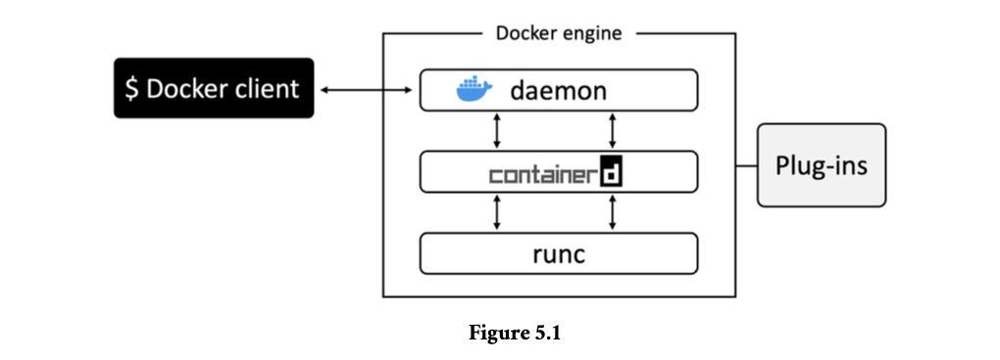
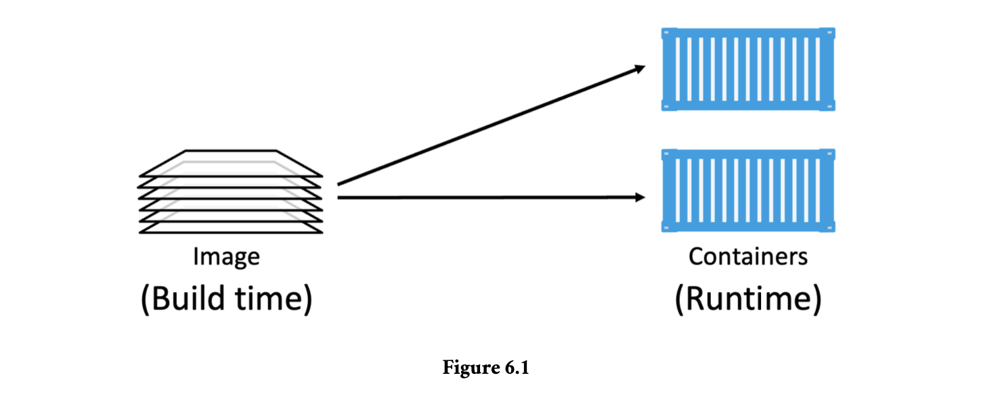
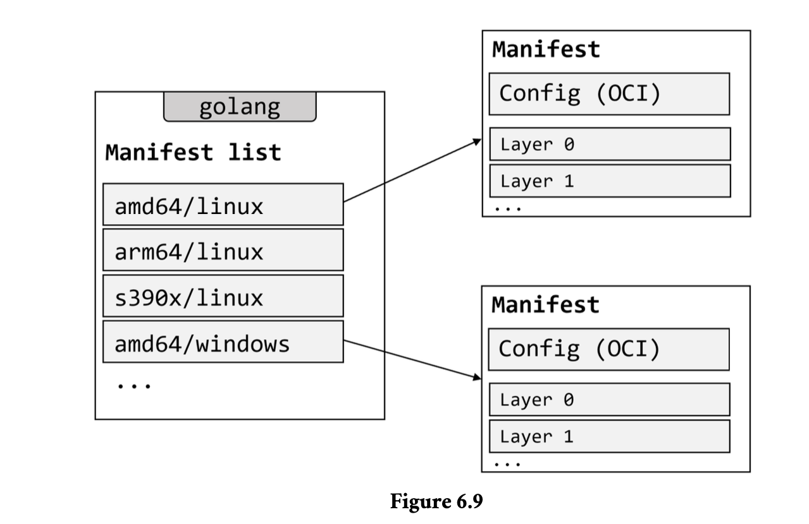
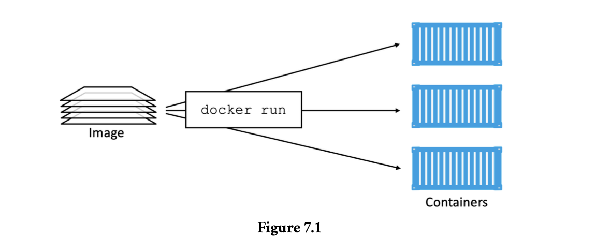
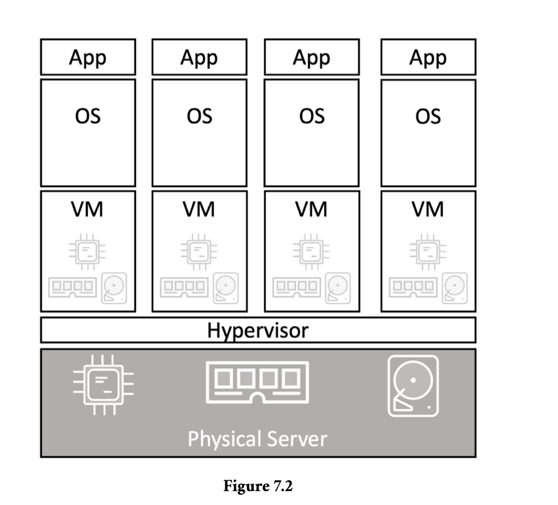
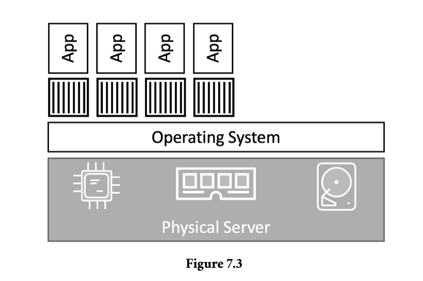

### Docker Engine

The Docker engine is the core software that runs and manages containers.

the Docker Engine is like a `car engine` — both are modular and created by
connecting many small specialized parts - The API, image builder, high-level runtime, low-level
runtime, shims etc.

The major components that make up the Docker engine are
the Docker daemon, the build system, containerd, runc, and various plugins such as
networking and volumes. Together, these create and run containers.



### Docker Engine - The Deep Dive

When Docker was first released, the Docker engine had two major components:

- The Docker daemon (sometimes referred to as just “the daemon”)
- LXC

The `Docker daemon` was a monolithic binary – it contained all the code for API, the
runtime, image builds, and more.

`LXC` provided the daemon with access to the fundamental building-blocks of containers
that existed in the Linux kernel. Things like namespaces and control groups (cgroups).

### Getting rid of LXC

- LXC is Linux-specific, not multi-platform
- being reliant on an external tool for something so core to the project was a
  huge risk.

As a result, Docker. Inc. developed their own tool called libcontainer as a replacement for
LXC.

The goal of `libcontainer` was to be a platform-agnostic tool that provided Docker
with access to the fundamental container building-blocks that exist in the host kernel.

### Getting rid of the monolithic Docker daemon

1. It’s hard to innovate on
2. It got slower
3. It wasn’t what the ecosystem wanted

To break the monolithic daemon and to modularize it, they reimplemented it in smaller specialized tools.

The specialized tools can be swapped out, as well as easily re-used
by third parties to build other tools.

### runc

runc is the OCI container-runtime-spec reference implementation.

runc has a single purpose in life — create containers. And it’s fast. But as it’s a CLI
wrapper, it’s effectively a standalone container runtime tool. This means you can
download and build the binary, and you’ll have everything you need to build and play
with runc (OCI) containers.

### containerd

Its sole purpose in life is to manage container lifecycle
operations such as start | stop | pause | rm....

apart from managing container lifecyle, it also manages things like image pulls, volumes and
networks.

One of the reasons for adding more functionality is to make it easier to use in other
projects - for ex in kubernetes it’s beneficial for containerd to do things like push
and pull images.

### Starting a new container (example)

docker run --name ctr1 -it alpine:latest sh

Once the daemon receives the command to create a new container, it makes a call
to containerd

`daemon no longer contains the code to create containers`

The daemon communicates with containerd via a CRUD-style API over gRPC10

`containerd` cannot actually create containers. It uses runc to do that

`runc` interfaces with the OS kernel to pull together all of the constructs necessary to
create a container (namespaces, cgroups etc.)

The container process is started as a child-
process of runc, and as soon as it starts, runc will exit.

**One huge benefit of this model**

```note
Having all of the logic and code to start and manage containers removed from the
daemon means that the entire container runtime is decoupled from the Docker daemon.
We sometimes call this “daemonless containers” and it makes it possible to perform maintenance and upgrades on the Docker daemon without impacting running contain-
ers.

```

### What’s this shim all about?

The shim is integral to the implementation of daemonless containers.

containerd uses runc to create new containers. In fact, it forks
a new instance of runc for every container it creates.However, once each container is
created, the runc process exits. This means we can run hundreds of containers without
having to run hundreds of runc instances.

Once a container’s parent runc process exits, the associated containerd-shim process
becomes the container’s parent

**Some of the responsibilities the shim performs as a
container’s parent include:**

- Keeping any STDIN and STDOUT streams open so that when the daemon is
  restarted, the container doesn’t terminate due to pipes being closed etc.
- Reports the container’s exit status back to the daemon.

### Images

#### TLDR

A container image is read-only package that contains everything you need to run an
application.

It includes application code, application dependencies, a minimal set of OS
constructs, and metadata. A single image can be used to `start one or more containers`.

a container image is like a `stopped container`.
If you’re a developer you can think of them as similar to `classes`. You can create one or
more objects from a class — you can create one or more containers from an image.

You get container images by pulling them from a `registry`.The most common registry is
`Docker Hub` but others exist.The pull operation downloads an image to your local
Docker host where Docker can use it to start one or more containers.

Images are made up of multiple layers - stacked on top of each other.

containers are intended to be fast and lightweight, images tend to be small (Windows images tend to be
huge).

### Docker images - The deep dive

images are considered build-time constructs, whereas containers are run-time constructs.



We use the `docker run` and `docker service create` commands to start one or more
containers from a single image.

Once you’ve started a container from an image, the two
constructs become dependent on each other, and you cannot delete the image until the
last container using it has been stopped and destroyed.

Images don’t include a kernel. This is because containers share the kernel of the host
they’re running on.

```note
Windows-based images tend to be a lot bigger than Linux-based images because of the
way the Windows OS works.
```

### Pulling Images

The process of getting images onto a Docker host is called pulling.

```note
$ docker pull redis:latest
latest: Pulling from library/redis
b5d25b35c1db: Pull complete
6970efae6230: Pull complete
fea4afd29d1f: Pull complete
7977d153b5b9: Pull complete
7945d827bd72: Pull complete
b6aa3d1ce554: Pull complete
Digest: sha256:ea30bef6a1424d032295b90db20a869fc8db76331091543b7a80175cede7d887
Status: Downloaded newer image for redis:latest
docker.io/library/redis:latest
```

### Image Registries

registry is to securely store container images and make them easy to access from
different environments.

Image registries contain one or more image repositories.

Trust images from official hub.docker

- nginx: https://hub.docker.com/_/nginx/
- busybox: https://hub.docker.com/_/busybox/
- redis: https://hub.docker.com/_/redis/
- mongo: https://hub.docker.com/_/mongo/

The format for docker pull, when working with
an image from an official repository is:

```note
$ docker pull <repository>:<tag>
```

These pulled the images tagged as “latest” from the top-level “alpine” and “redis”
repositories.

```note
$ docker pull alpine

if you do not specify an image tag after the repository name, Docker will assume
you are referring to the image tagged as latest. If the repository doesn’t have an image
tagged as latest the command will fail.
```

latest is an arbitrary tag and is not
guaranteed to point to the newest image in a repository!

```note
$ docker images
REPOSITORY TAG IMAGE ID CREATED SIZE
nigelpoulton/tu-demo latest c610c6a38555 22 months ago 58.1MB
nigelpoulton/tu-demo v1 c610c6a38555 22 months ago 58.1MB
```

### Filtering the output of docker images

Docker provides the --filter flag to filter the list of images returned by docker
images.

```note
$ docker images --filter dangling=true

REPOSITORY TAG IMAGE ID CREATED SIZE
<none> <none> 4fd34165afe0 7 days ago 14.5MB
```

A dangling image is one that is no longer tagged and appears in listings as <none>:<none>.

A common way they occur is when building a new image with a tag that already exists.

You can delete all dangling images on a system with the `docker image prune` command.

Docker currently supports the following filters:

- `dangling`: Accepts true or false, and returns only dangling images (true), or non-
  dangling images (false).
- `before`: Requires an image name or ID as argument, and returns all images
  created before it.
- `since`: Same as above, but returns images created after the specified image.
- `label`: Filters images based on the presence of a label or label and value. The
  docker images command does not display labels in its output.

### Searching Docker Hub from the CLI

The docker search command lets you search Docker Hub from the CLI

```note
$ docker search nigelpoulton
NAME DESCRIPTION STARS AUTOMATED
nigelpoulton/pluralsight.. Web app used in... 22 [OK]
nigelpoulton/tu-demo 12
nigelpoulton/k8sbook Kubernetes Book web app 2
nigelpoulton/workshop101 Kubernetes 101 Workshop 0
<Snip>
```

Notice how some of the repositories returned are official and some are unofficial. You
can use --filter "is-official=true" so that only official repos are displayed.

```note
$ docker search alpine --filter "is-official=true"
NAME DESCRIPTION STARS OFFICIAL AUTOMATED
alpine A minimal Docker.. 9962 [OK]
```

### Images and layers

A Docker image is a collection of loosely-connected read-only layers where each layer
comprises one or more files.


Docker takes care of stacking the layers and representing them as a single unified object.

Each line in the output above that ends with “Pull complete” represents a layer in the
image the was pulled

Another way to see the layers of an image is to inspect the image with the `docker
inspect` command.It is a great way to see the details of an image.

All Docker images start with a base layer, and as changes are made and new content is
added, new layers are added on top.

Docker employs a storage driver that is responsible for stacking layers and presenting
them as a single unified filesystem/image

### Pulling images by digest

pulling images using their name (tag) has problems- tags are mutable! (accidentally tag an image with the wrong tag name)

```note
When a image pulled has a bug, you fix it and push it with the same tag, the production containers are vulnerable to use which image as both has same tags.
```

This is where `image digests` come to the rescue.

As the digest is a hash of the contents of the image, it’s impossible to change
the contents of the image without creating a new unique digest.

Put another way, you
cannot change the content of an image and keep the old digest. This means digests are
immutable and provide a solution to the problem we just mentioned.

```note
$ docker images --digests alpine

REPOSITORY TAG DIGEST IMAGE ID CREATED SIZE
alpine latest sha256:02bb6f42...44c9b11 44dd6f223004 9 days ago 7.73MB

The snipped output above shows the digest for the alpine image as -
sha256:02bb6f42...44c9b11
```

Each image is identified by a crypto ID that is a hash of the manifest file. Each layer is
identified by a crypto ID that is a hash of the layer content.

This means that changing the contents of the image, or any of its layers, will cause the
associated crypto hashes to change. As a result, images and layers are immutable and we
can easily identify if changes have been made.

When we push and pull images, the layers are compressed to save network bandwidth
and storage space in the registry. However, compressed content is different to un-
compressed content. As a result, content hashes no longer match after push or pull
operations.

To get around this, each layer also gets something called a `distribution hash`. This is a
hash of the compressed version of the layer and is included with every layer pushed and
pulled to a registry. This is used to verify that the layer arrived without being tampered
with.

you can run a simple docker pull golang:latest
from any platform or architecture and Docker will pull the correct image.

To make this happen, the Registry API supports two important constructs:

- manifest lists
- manifests

The manifest list is exactly what it sounds like: a list of architectures supported by a
particular image tag. Each supported architecture then has its own manifest that lists the
layers used to build it.



When you pull
an image, Docker makes the relevant calls to Docker Hub. If a manifest list exists for
the image, it will be parsed to see if an entry exists for Linux on ARM. If it exists, the
manifest for the Linux ARM image is retrieved and parsed for the crypto ID’s of the
layers. Each layer is then pulled from Docker Hub and assembled on the Docker host.

The ‘docker manifest’ command lets you inspect the manifest list of any image on
Docker Hub.

### Deleting Images

```note
$ docker rmi 44dd6f223004
Untagged: alpine@sha256:02bb6f428431fbc2809c5d1...9a33cb1af4444c9b11
Deleted: sha256:44dd6f2230041eede4ee5e7...09399391535c0c0183b
Deleted: sha256:94dd7d531fa5695c0c033dc...97252ba88da87169c3f
```

This returns all the image ID's of all local images

```note
$ docker images -q
44dd6f223004
3f5ef9003cef
```

### Containers

A container is the runtime instance of an image.
n the same way that you can start a
virtual machine (VM) from a virtual machine template, you start one or more containers
from a single image.

he big difference between a VM and a container is that containers
are `smaller, faster, and more portable.`



```note
docker run <image> <app>.

The following command will start a new
container based on the Ubuntu Linux image and start a Bash shell.
```

```note
$ docker run -it ubuntu /bin/bash`

The -it flags connect your current terminal window to the container’s shell.
```

Containers run until the main app exits. In the previous example, the container will exit
when the Bash shell exits.

```note
docker stop - stop running container
docker start - restart stopped container
docker rm - delete container
```

### Containers vs VMs

Lets assume we have single physical server and 4 bussiness applications

In the VM model, the physical server is powered on and the hypervisor boots. Once
booted, the hypervisor claims all physical resources such as CPU, RAM, storage, and
network cards. It then carves these hardware resources into virtual constructs that look
smell and feel exactly like the real thing. It then packages them into a software construct
called a virtual machine (VM). We take those VMs and install an operating system and
application on each one.

**— we’d create 4 VMs, install 4 operating systems, and then install the 4 applications.**



In container model,The server is powered on and the OS boots. In this container model the host’s OS claims all hardware resources. Next you install a container engine such as Docker. The
container engine then carves-up the OS resources (process tree, filesystem, network stack
etc) and packages them into virtual operating systems called containers. Each container
looks smells and feels just like a real OS. Inside of each container we run an application.

**we’d carve the OS into 4 containers and run a single application inside
each.**



`hypervisors` - perform hardware virtualization,they carve up physical
hardware resources into virtual versions called VMs.
`containers` - perform OS virtualization, they carve OS resources into virtual versions called
containers.

The VM model carves `low-level hardware resources` into VMs. Each VM is a software
construct containing virtual CPUs, virtual RAM, virtual disks etc. As such, every
VM needs its own OS to claim, initialize, and manage all of those virtual resources.
Unfortunately, every OS comes with its own set of baggage and overheads. For example,
every OS consumes CPU, RAM, and storage. Some need their own licenses, as well as
people and infrastructure to patch and update them. Each OS also presents a sizable
attack surface. We often refer to all of this as the OS tax, or VM tax — every OS is
steeling resources you’d rather assign to applications.

There’s only one OS kernel in the container model, and that’s running on the shared
host. And it’s possible to hundreds of containers on a single host with a single shared
OS. This means a one OS consuming CPU, RAM, and storage. It also means a single
OS that needs licensing, a single OS that needs updating and patching, and a single OS
presenting an attack surface. All in all, a single OS tax bill.

```note

Containers start a lot faster than
VMs because they only have to start the application — the kernel is already up and
running on the host. In the VM model, each VM needs to boot a full OS before it can
start the app.
```

**This all makes the container model leaner and more efficient than the VM model.
You can pack more applications onto less resources, start them faster, and pay less in
licensing and admin costs, as well as present less of an attack surface!**

### Checking that Docker is running

check docker version

$ docker version
