### Docker Engine

The Docker engine is the core software that runs and manages containers.

the Docker Engine is like a `car engine` — both are modular and created by
connecting many small specialized parts - The API, image builder, high-level runtime, low-level
runtime, shims etc.

The major components that make up the Docker engine are
the Docker daemon, the build system, containerd, runc, and various plugins such as
networking and volumes. Together, these create and run containers.


### Docker Engine - The Deep Dive

When Docker was first released, the Docker engine had two major components:

- The Docker daemon (sometimes referred to as just “the daemon”)
- LXC

The `Docker daemon` was a monolithic binary – it contained all the code for API, the
runtime, image builds, and more.

`LXC` provided the daemon with access to the fundamental building-blocks of containers
that existed in the Linux kernel. Things like namespaces and control groups (cgroups).

### Getting rid of LXC

- LXC is Linux-specific, not multi-platform
- being reliant on an external tool for something so core to the project was a
  huge risk.

As a result, Docker. Inc. developed their own tool called libcontainer as a replacement for
LXC.

The goal of `libcontainer` was to be a platform-agnostic tool that provided Docker
with access to the fundamental container building-blocks that exist in the host kernel.

### Getting rid of the monolithic Docker daemon

1. It’s hard to innovate on
2. It got slower
3. It wasn’t what the ecosystem wanted

To break the monolithic daemon and to modularize it, they reimplemented it in smaller specialized tools.

The specialized tools can be swapped out, as well as easily re-used
by third parties to build other tools.

### runc

runc is the OCI container-runtime-spec reference implementation.

runc has a single purpose in life — create containers. And it’s fast. But as it’s a CLI
wrapper, it’s effectively a standalone container runtime tool. This means you can
download and build the binary, and you’ll have everything you need to build and play
with runc (OCI) containers.

### containerd

Its sole purpose in life is to manage container lifecycle
operations such as start | stop | pause | rm....

apart from managing container lifecyle, it also manages things like image pulls, volumes and
networks.

One of the reasons for adding more functionality is to make it easier to use in other
projects - for ex in kubernetes it’s beneficial for containerd to do things like push
and pull images.

### Starting a new container (example)

docker run --name ctr1 -it alpine:latest sh

Once the daemon receives the command to create a new container, it makes a call
to containerd

`daemon no longer contains the code to create containers`

The daemon communicates with containerd via a CRUD-style API over gRPC10

`containerd` cannot actually create containers. It uses runc to do that

`runc` interfaces with the OS kernel to pull together all of the constructs necessary to
create a container (namespaces, cgroups etc.)

The container process is started as a child-
process of runc, and as soon as it starts, runc will exit.

**One huge benefit of this model**

```note
Having all of the logic and code to start and manage containers removed from the daemon means that the entire container runtime is decoupled from the Docker daemon.
We sometimes call this “daemonless containers” and it makes it possible to perform maintenance and upgrades on the Docker daemon without impacting running containers.

```

### What’s this shim all about?

The shim is integral to the implementation of daemonless containers.

containerd uses runc to create new containers. In fact, it forks
a new instance of runc for every container it creates.However, once each container is
created, the runc process exits. This means we can run hundreds of containers without
having to run hundreds of runc instances.

Once a container’s parent runc process exits, the associated containerd-shim process
becomes the container’s parent

**Some of the responsibilities the shim performs as a
container’s parent include:**

- Keeping any STDIN and STDOUT streams open so that when the daemon is
  restarted, the container doesn’t terminate due to pipes being closed etc.
- Reports the container’s exit status back to the daemon.

### Images

#### TLDR

A container image is read-only package that contains everything you need to run an
application.

It includes application code, application dependencies, a minimal set of OS
constructs, and metadata. A single image can be used to `start one or more containers`.

a container image is like a `stopped container`.
If you’re a developer you can think of them as similar to `classes`. You can create one or
more objects from a class — you can create one or more containers from an image.

You get container images by pulling them from a `registry`.The most common registry is
`Docker Hub` but others exist.The pull operation downloads an image to your local
Docker host where Docker can use it to start one or more containers.

Images are made up of multiple layers - stacked on top of each other.

containers are intended to be fast and lightweight, images tend to be small (Windows images tend to be
huge).

### Docker images - The deep dive

images are considered build-time constructs, whereas containers are run-time constructs.


We use the `docker run` and `docker service create` commands to start one or more
containers from a single image.

Once you’ve started a container from an image, the two
constructs become dependent on each other, and you cannot delete the image until the
last container using it has been stopped and destroyed.

Images don’t include a kernel. This is because containers share the kernel of the host
they’re running on.

```note
Windows-based images tend to be a lot bigger than Linux-based images because of the way the Windows OS works.
```

### Pulling Images

The process of getting images onto a Docker host is called pulling.

```note
$ docker pull redis:latest
latest: Pulling from library/redis
b5d25b35c1db: Pull complete
6970efae6230: Pull complete
fea4afd29d1f: Pull complete
7977d153b5b9: Pull complete
7945d827bd72: Pull complete
b6aa3d1ce554: Pull complete
Digest: sha256:ea30bef6a1424d032295b90db20a869fc8db76331091543b7a80175cede7d887
Status: Downloaded newer image for redis:latest
docker.io/library/redis:latest
```

### Image Registries

registry is to securely store container images and make them easy to access from
different environments.

Image registries contain one or more image repositories.

Trust images from official hub.docker

- nginx: https://hub.docker.com/_/nginx/
- busybox: https://hub.docker.com/_/busybox/
- redis: https://hub.docker.com/_/redis/
- mongo: https://hub.docker.com/_/mongo/

The format for docker pull, when working with
an image from an official repository is:

```note
$ docker pull <repository>:<tag>
```

These pulled the images tagged as “latest” from the top-level “alpine” and “redis”
repositories.

```note
$ docker pull alpine

if you do not specify an image tag after the repository name, Docker will assume you are referring to the image tagged as latest. If the repository doesn’t have an image tagged as latest the command will fail.
```

latest is an arbitrary tag and is not
guaranteed to point to the newest image in a repository!

```note
$ docker images
REPOSITORY TAG IMAGE ID CREATED SIZE
nigelpoulton/tu-demo latest c610c6a38555 22 months ago 58.1MB
nigelpoulton/tu-demo v1 c610c6a38555 22 months ago 58.1MB
```

### Filtering the output of docker images

Docker provides the --filter flag to filter the list of images returned by docker
images.

```note
$ docker images --filter dangling=true

REPOSITORY TAG IMAGE ID CREATED SIZE
<none> <none> 4fd34165afe0 7 days ago 14.5MB
```

A dangling image is one that is no longer tagged and appears in listings as <none>:<none>.

A common way they occur is when building a new image with a tag that already exists.

You can delete all dangling images on a system with the `docker image prune` command.

Docker currently supports the following filters:

- `dangling`: Accepts true or false, and returns only dangling images (true), or non-
  dangling images (false).
- `before`: Requires an image name or ID as argument, and returns all images
  created before it.
- `since`: Same as above, but returns images created after the specified image.
- `label`: Filters images based on the presence of a label or label and value. The
  docker images command does not display labels in its output.

### Searching Docker Hub from the CLI

The docker search command lets you search Docker Hub from the CLI

```note
$ docker search nigelpoulton
NAME DESCRIPTION STARS AUTOMATED
nigelpoulton/pluralsight.. Web app used in... 22 [OK]
nigelpoulton/tu-demo 12
nigelpoulton/k8sbook Kubernetes Book web app 2
nigelpoulton/workshop101 Kubernetes 101 Workshop 0
<Snip>
```

Notice how some of the repositories returned are official and some are unofficial. You
can use --filter "is-official=true" so that only official repos are displayed.

```note
$ docker search alpine --filter "is-official=true"
NAME DESCRIPTION STARS OFFICIAL AUTOMATED
alpine A minimal Docker.. 9962 [OK]
```

### Images and layers

A Docker image is a collection of loosely-connected read-only layers where each layer
comprises one or more files.


Docker takes care of stacking the layers and representing them as a single unified object.

Each line in the output above that ends with “Pull complete” represents a layer in the
image the was pulled

Another way to see the layers of an image is to inspect the image with the `docker
inspect` command.It is a great way to see the details of an image.

All Docker images start with a base layer, and as changes are made and new content is
added, new layers are added on top.

Docker employs a storage driver that is responsible for stacking layers and presenting
them as a single unified filesystem/image

### Pulling images by digest

pulling images using their name (tag) has problems- tags are mutable! (accidentally tag an image with the wrong tag name)

```note
When a image pulled has a bug, you fix it and push it with the same tag, the production containers are vulnerable to use which image as both has same tags.
```

This is where `image digests` come to the rescue.

As the digest is a hash of the contents of the image, it’s impossible to change
the contents of the image without creating a new unique digest.

Put another way, you
cannot change the content of an image and keep the old digest. This means digests are
immutable and provide a solution to the problem we just mentioned.

```note
$ docker images --digests alpine

REPOSITORY TAG DIGEST IMAGE ID CREATED SIZE
alpine latest sha256:02bb6f42...44c9b11 44dd6f223004 9 days ago 7.73MB

The snipped output above shows the digest for the alpine image as -
sha256:02bb6f42...44c9b11
```

Each image is identified by a crypto ID that is a hash of the manifest file. Each layer is
identified by a crypto ID that is a hash of the layer content.

This means that changing the contents of the image, or any of its layers, will cause the
associated crypto hashes to change. As a result, images and layers are immutable and we
can easily identify if changes have been made.

When we push and pull images, the layers are compressed to save network bandwidth
and storage space in the registry. However, compressed content is different to un-
compressed content. As a result, content hashes no longer match after push or pull
operations.

To get around this, each layer also gets something called a `distribution hash`. This is a
hash of the compressed version of the layer and is included with every layer pushed and
pulled to a registry. This is used to verify that the layer arrived without being tampered
with.

you can run a simple docker pull golang:latest
from any platform or architecture and Docker will pull the correct image.

To make this happen, the Registry API supports two important constructs:

- manifest lists
- manifests

The manifest list is exactly what it sounds like: a list of architectures supported by a
particular image tag. Each supported architecture then has its own manifest that lists the
layers used to build it.


When you pull
an image, Docker makes the relevant calls to Docker Hub. If a manifest list exists for
the image, it will be parsed to see if an entry exists for Linux on ARM. If it exists, the
manifest for the Linux ARM image is retrieved and parsed for the crypto ID’s of the
layers. Each layer is then pulled from Docker Hub and assembled on the Docker host.

The ‘docker manifest’ command lets you inspect the manifest list of any image on
Docker Hub.

### Deleting Images

```note
$ docker rmi 44dd6f223004
Untagged: alpine@sha256:02bb6f428431fbc2809c5d1...9a33cb1af4444c9b11
Deleted: sha256:44dd6f2230041eede4ee5e7...09399391535c0c0183b
Deleted: sha256:94dd7d531fa5695c0c033dc...97252ba88da87169c3f
```

This returns all the image ID's of all local images

```note
$ docker images -q
44dd6f223004
3f5ef9003cef
```

### Containers

A container is the runtime instance of an image.In the same way that you can start a
virtual machine (VM) from a virtual machine template, you start one or more containers
from a single image.

The big difference between a VM and a container is that containers
are `smaller, faster, and more portable.`


```note
docker run <image> <app>.

The following command will start a new
container based on the Ubuntu Linux image and start a Bash shell.
```

```note
$ docker run -it ubuntu /bin/bash`

The -it flags connect your current terminal window to the container’s shell.
```

Containers run until the main app exits. In the previous example, the container will exit
when the Bash shell exits.

```note
docker stop - stop running container
docker start - restart stopped container
docker rm - delete container
```

### Containers vs VMs

Lets assume we have single physical server and 4 bussiness applications

In the VM model, the physical server is powered on and the hypervisor boots. Once
booted, the hypervisor claims all physical resources such as CPU, RAM, storage, and
network cards. It then carves these hardware resources into virtual constructs that look
smell and feel exactly like the real thing. It then packages them into a software construct
called a virtual machine (VM). We take those VMs and install an operating system and
application on each one.

**— we’d create 4 VMs, install 4 operating systems, and then install the 4 applications.**


In container model,The server is powered on and the OS boots. In this container model the host’s OS claims all hardware resources. Next you install a container engine such as Docker. The
container engine then carves-up the OS resources (process tree, filesystem, network stack
etc) and packages them into virtual operating systems called containers. Each container
looks smells and feels just like a real OS. Inside of each container we run an application.

**we’d carve the OS into 4 containers and run a single application inside
each.**


`hypervisors` - perform hardware virtualization,they carve up physical
hardware resources into virtual versions called VMs.
`containers` - perform OS virtualization, they carve OS resources into virtual versions called
containers.

The VM model carves `low-level hardware resources` into VMs. Each VM is a software
construct containing virtual CPUs, virtual RAM, virtual disks etc. As such, every
VM needs its own OS to claim, initialize, and manage all of those virtual resources.
Unfortunately, every OS comes with its own set of baggage and overheads. For example,
every OS consumes CPU, RAM, and storage. Some need their own licenses, as well as
people and infrastructure to patch and update them. Each OS also presents a sizable
attack surface. We often refer to all of this as the OS tax, or VM tax — every OS is
steeling resources you’d rather assign to applications.

There’s only one OS kernel in the container model, and that’s running on the shared
host. And it’s possible to hundreds of containers on a single host with a single shared
OS. This means a one OS consuming CPU, RAM, and storage. It also means a single
OS that needs licensing, a single OS that needs updating and patching, and a single OS
presenting an attack surface. All in all, a single OS tax bill.

```note

Containers start a lot faster than VMs because they only have to start the application — the kernel is already up and
running on the host. In the VM model, each VM needs to boot a full OS before it can sstart the app.
```

**This all makes the container model leaner and more efficient than the VM model.
You can pack more applications onto less resources, start them faster, and pay less in
licensing and admin costs, as well as present less of an attack surface!**

### Checking that Docker is running

check docker version

$ docker version

Once the image is pulled, the daemon instructs containerd to start the container.
containerd tasks runc with creating the container and starting the app.

**container cannot exist without its designated main process.killing the main process in the container will kill the container.**

```note
You can use the docker ps command to view the list of running
containers on your system.

$ docker ps
CNTNR ID IMAGE COMMAND CREATED STATUS NAMES
e37..7e0a ubuntu:latest /bin/bash 6 mins Up 6mins sick_montalcini

It’s important to understand that this container is still running and you can re-attach
your terminal to it with the docker exec command.

$ docker exec -it e37f24dc7e0a bash
root@e37f24dc7e0a:/#

```

If you run the ps -
elf command again you will now see two Bash processes. This is because the docker exec command created a new Bash process and attached to that. This means typing exit in this shell will not terminate the container, because the original Bash process will
continue running.

### Container lifecycle

```note
$ docker ps -a
CNTNR ID IMAGE COMMAND CREATED STATUS NAMES
9cb...65 ubuntu:latest /bin/bash 4 mins Exited (0) percy

to view all the containers, even that are stopped
```

**stopping a container does not destroy the container or the data inside of it.**

```note
1. The data created in this example is stored on the Docker hosts local filesystem. If the Docker host fails, the data will be lost.

2.Containers are designed to be immutable objects and it’s not a good practice to write data to them.
```

For these reasons, Docker provides `volumes`. These exist outside of containers but can be mounted into them.

You can stop, start, pause, and restart a container as many times as you want.Even after explicitly deleting it,if you’re storing data outside the container in a
volume, the data will persist even after the container has gone.

`docker stop` - It gives the process inside of the
container∼10 seconds to complete any final tasks and gracefully shutdown. Once the command completes, you can delete the container with docker rm.

```note
Behind the scenes the docker stop command sends a SIGTERM signal to the main application process inside the container (PID 1). This is a request to terminate and
gives the process a chance to clean things up and gracefully shut itself down. If it’s still
running after 10 seconds it will be issued a SIGKILL which terminates it with force.

A docker rm <container> -f doesn’t bother asking nicely with a SIGTERM, it goes straight to the SIGKILL.
```

### Self-healing containers with restart policies

It’s often a good idea to run containers with a restart policy.

Restart policies are applied per-container. They can be configured imperatively on the command line as part of docker run commands, or declaratively in YAML files for use
with higher-level tools such as Docker Swarm, Docker Compose, and Kubernetes.

- always
- unless-stopped
- on-failure

### Always policy

It always restarts a failed container unless it’s
been explicitly stopped.

$ docker run --name neversaydie -it --restart always alpine sh
/#

Typing exit from the shell will kill the container’s PID 1 process and kill the container. However, Docker
will automatically restart it because it has the --restart always policy.

$ docker ps
CONTAINER ID IMAGE COMMAND CREATED STATUS NAME
0901afb84439 alpine "sh" 35 seconds ago Up 9 seconds neversaydie

**if you inspect it with docker inspect you can see the restartCount has been incremented.**

An interesting feature of the --restart always policy is that if you stop a container with docker stop and then restart the Docker daemon, the container will be restarted.

The main difference between the `always and unless-stopped policies` is that containers with the `--restart unless-stopped` policy will not be restarted when the daemon restarts if they were in the Stopped (Exited) state.

### on-failure policy

will restart a container if it exits with a non-zero exit code.It will
also restart containers when the Docker daemon restarts, even ones that were in the stopped state.

```note
services:
myservice:
<Snip>
restart_policy:
condition: always | unless-stopped | on-failure
```

### WebServer example

$ docker run -d --name webserver -p 80:8080 \
nigelpoulton/ddd-book:web0.1

`-d option` : doesn't attach to the terminal.-d stands for detached or daemon mode and tells the container to run in
the background.

```note
You can’t use the -d and -it flags in the same command.
```

`-p 80:8080`: The -p flag maps port 80 on
the Docker host to port 8080 inside the container. This means that traffic hitting the
Docker host on port 80 will be directed to port 8080 inside of the container.

The image
we’re using for this container contains a web service that listens on port 8080. This
means the container will come up running a web server listening on port 8080.

The entries after Cmd or Entrypoint show the app that the container will run unless you override it with a different one when you launch it with docker run.

```note
$ docker rmi $(docker ps -aq) -f
It will delete all containers without warning.
```

`-f flag` forces the operation so that even containers in the running state will be destroyed.

### Containers - The commands

`docker ps` lists all containers in the running state. If you add the -a flag you will also see containers in the stopped (Exited) state.

`docker exec` runs a new process inside of a running container. It’s useful for attaching the shell of your Docker host to a terminal inside a running container.

`docker stop` will stop a running container and put it in the Exited (0) state.

`docker start` will restart a stopped container. You can give it the name or ID of a container.

`docker rm` will delete a stopped container.

`docker inspect` will show you detailed configuration and runtime information about a container

### 8.Containerizing an app

Docker is all about making it easy to take application source code and get it running in a container. This process is called containerization.

#### Containerizing an app - The TLDR

Containers are all about making apps simple to build, ship, and run. The end-to-end process looks like this:

- Start with your application code and dependencies
- Create a Dockerfile that describes your app, dependencies, and how to run it
- Build it into an image by passing the Dockerfile to the docker build command
- Push the new image to a registry (optional)
- Run a container from the image

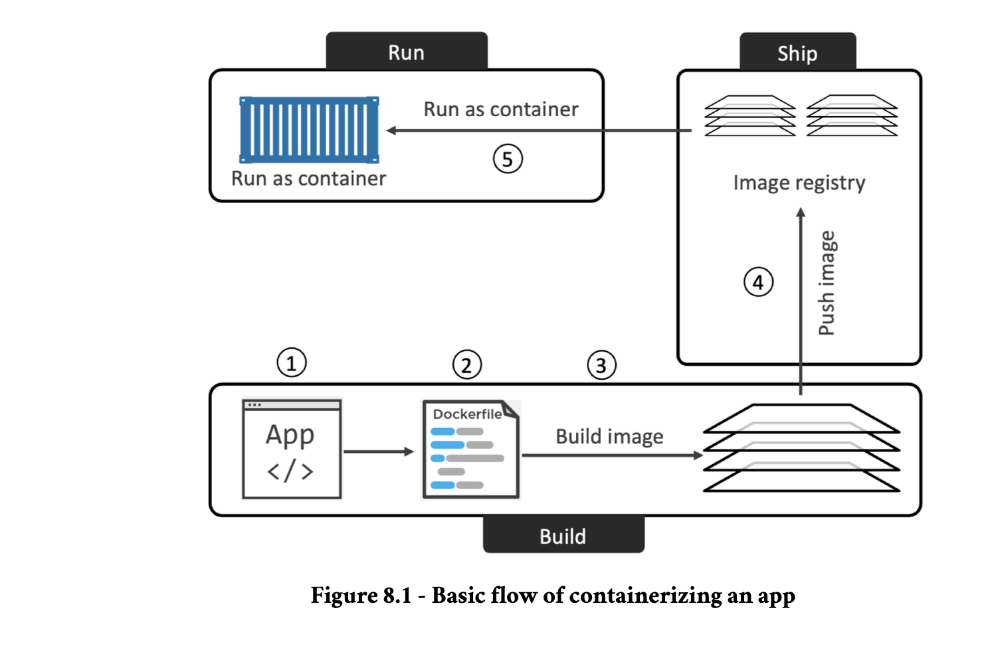

### Containerizing an app - The deep dive

#### Containerize a single-container app

We’ll complete the following high-level steps:

- Clone the repo to get the app code
- Inspect the Dockerfile
- Containerize the app
- Run the app
- Test the app
- Look a bit closer

$ git clone https://github.com/nigelpoulton/ddd-book.git

$ cd ddd-book/web-app

This directory is called the build context and contains all of the application source code,
as well as file containing a list of dependencies.

#### Inspecting the Dockerfile

A Dockerfile describes an application and tells Docker how to build it into an image.It accurately describes the application and its dependencies in an easy-to-read format.

```note
$ cat Dockerfile
FROM alpine
LABEL maintainer="nigelpoulton@hotmail.com"
RUN apk add --update nodejs npm
COPY . /src
WORKDIR /src
RUN npm install
EXPOSE 8080
ENTRYPOINT ["node", "./app.js"]

At a high-level, the example Dockerfile says: Start with the alpine image, make a note that “nigelpoulton@hotmail.com” is the maintainer, install Node.js and NPM, copy everything in the build context to the /src directory in the image, set the working directory as /src, install dependencies, document the app’s network port, and set app.js as the default application to run.

```

Dockerfiles normally start with the FROM instruction. This pulls an image that will be
used as the `base layer` for the image the Dockerfile will build – everything else will be added as new layers above this base layer.

The RUN apk add --update nodejs nodejs-npm instruction uses the apk package
manager to install nodejs and nodejs-npm into the image. It does this by adding a new
layer and installing the packages to this layer.

The COPY . /src instruction creates another new layer and copies in the application and dependency files from the build context. Now the image has three layers

Next, the Dockerfile uses the WORKDIR instruction to set the working directory for the rest of the instructions. This creates metadata and does not create a new image layer.

The RUN npm install instruction runs within the context of the WORKDIR set in the
previous instruction, and installs the dependencies listed in package.json into another
new layer.


The application exposes a web service on port 8080, so the Dockerfile documents this with the EXPOSE 8080 instruction. Finally, the ENTRYPOINT instruction sets the application to run when started as a container. Both of these are added as metadata and do not create new layers.

### Containerize the app/build the image

The following command will build a new image called ddd-book:ch8.1.

$ docker build -t ddd-book:ch8.1 .

```note
[+] Building 16.2s (10/10) FINISHED
=> [internal] load build definition from Dockerfile => => transferring dockerfile: 335B => => transferring context: 2B => [1/5] FROM docker.io/library/alpine 0.1s
=> CACHED [2/5] RUN apk add --update nodejs npm curl => [3/5] COPY . /src => [4/5] WORKDIR /src 0.0s
=> [5/5] RUN npm install => exporting to image 0.2s
=> => exporting layers 0.2s
=> => writing image sha256:f282569b8bd0f0...016cc1adafc91 0.0s
0.0s
0.0s
0.0s
0.0s
10.4s
0.0s
=> => naming to docker.io/library/ddd-book:ch8.1
```

The period (.) at the end of the command tells Docker to use the working directory as the build context. Remember, the build context is where the app and all dependencies are stored.

**Notice the five numbered steps reported in the build output. Those are the steps that
create the five image layers.**

Congratulations, the app is containerized!

### Pushing images

It’s a good idea to store it in a registry to keep it safe and make it available to others.

Docker Hub is the most common public image registry and it’s the default push location for docker push commands.

Images need to be appropriately tagged before you can push them. This is because the
tag includes the following important registry-related information:

- Registry DNS name
- Repository name
- Tag

The format of the command is docker tag <current-tag> <new-tag>.

$ docker tag ddd-book:ch8.1 nigelpoulton/ddd-book:ch8.1

```note
$ docker push nigelpoulton/ddd-book:ch8.1
The push refers to repository [docker.io/nigelpoulton/ddd-book]
ccf07adfaecf: Pushed
5f70bf18a086: Layer already exists
efeb99f5a1b2: Pushed
a990a785ba64: Pushed
94dd7d531fa5: Layer already exists
ch8.1: digest: sha256:80063789bce73a17...09ea29c5e6a91c28b4 size: 1365
```

Now that the image is pushed to a registry, you can access it from anywhere with an internet connection. You can also grant other people access to pull it and push changes.

### Run the app

The containerized application is a web server that listens on port 8080.

$ docker run -d --name c1 \
-p 80:8080 \
ddd-book:ch8.1

The -d flag runs the container in the background, and the -p on the host to port 8080 inside the running container.
Check that the container is running and verify the port mapping.

### Test the app

Open a web browser and point it to the DNS name or IP address of the host that the
container is running on.

### Looking a bit closer

`docker build` command parses the Dockerfile one-line-at-a-time starting from the
top.

Some instructions create new layers whereas others just add metadata.

Examples of instructions that create new layers are `FROM, RUN, and COPY`.

Examples that create metadata include `EXPOSE, WORKDIR, ENV, and ENTRYPOINT.`

if an instruction adds content such as files and programs, it will create a new layer.
If it is adding instructions on how to build the image and run the container, it will create
metadata.

```note
You can view the instructions that were used to build the image with the docker
history command.
$ docker history ddd-book:ch8.1
IMAGE CREATED BY SIZE
f282569b8bd0 ENTRYPOINT ["node" "./app.js"] 0B
<missing> EXPOSE map[8080/tcp:{}] 0B
<missing> RUN /bin/sh -c npm install 24.2MB
<missing> WORKDIR /src 0B
<missing> COPY . /src # <missing> RUN /bin/sh -c apk add --update nodejs npm 8.41kB
63.4MB
<missing> LABEL maintainer=nigelpoulton@hotmail.com 0B
<missing> /bin/sh -c #(nop) CMD ["/bin/sh"] 0B
<missing> /bin/sh -c #(nop) ADD file:df7fccc3453b6ec1 7.73MB
```

Only 4 of the lines displayed in the output create new layers (the ones with
non-zero values in the SIZE column).

### Moving to production with Multi-stage Builds

When it comes to Docker images, big is bad! For example:

- Big means slow
- Big means more potential vulnerabilities
- Big means a bigger attack surface

container images should only contain the stuff needed to run your app in production.

In the past, keeping images small was hard work. However, multi-stage builds make it
easy.

Multi-stage builds have multiple FROM instructions in a single Dockerfile, and each FROM instruction is a new build stage.

You can do the heavy-lifting work of building your app
in a large image with all the compilers and other build tools required. You can then copy
the final production app into a tiny image used for production. You can also perform
build steps in parallel for faster builds.

```note
The Dockerfile is shown below:
FROM golang:1.20-alpine AS base
WORKDIR /src
COPY go.mod go.sum .
RUN go mod download
COPY . .
FROM base AS build-client
RUN go build -o /bin/client ./cmd/client
FROM base AS build-server
RUN go build -o /bin/server ./cmd/server
FROM scratch AS prod
COPY --from=build-client /bin/client /bin/
COPY --from=build-server /bin/server /bin/
ENTRYPOINT [ "/bin/server" ]
```

The first thing to note is that the Dockerfile has four FROM instructions. Each of these is
a distinct build stage and Docker numbers them starting from 0. However, each stage
has been given a friendly name.

- Stage 0 is called base
- Stage 1 is called build-client
- Stage 2 is called build-server
- Stage 3 is called prod

Each stage outputs an image that can be used by other stages. These intermediate images
are cleaned up when the final build completes.

The goal of the base stage is to create a `reusable build image` with all the tools needed to build the application in the later stages.

The build-client stage doesn’t pull a new image. Instead, it uses the FROM base AS build-client instruction to use the intermediate image created by the base stage.

The build-server stage does the same for the server component of the app and outputs an image that can be referenced by later stages as build-server

The prod stage pulls the minimal scratch image.It then uses the COPY --from instruction to copy the compiled client app from the build-client stage and the compiled server app from the build-server stage. It outputs the final image which is just the client and server apps in a tiny scratch image.

```note
$ docker images
REPO TAG IMAGE ID CREATED SIZE
multi stage 638e639de548 3 minutes ago 15MB
```

The final production image is only 15MB. This is a lot smaller than the 250MB base
image that was pulled to create the build. This is because the final stage of the multi-
stage build used the tiny scratch image and only added the compiled client and server
binaries.

### Multi-stage builds and build targets

It’s also possible to build multiple images from a single Dockerfile.

```note
We can reference these stage names in two docker build commands as follows. The
commands -f flag to reference the Dockerfile called Dockerfile-final that has the two
separate prod stages.

$ docker build -t multi:client --target prod-client -f Dockerfile-final .

$ docker build -t multi:server --target prod-server -f Dockerfile-final .
<Snip>
<Snip>
```

```note
Check the builds and images sizes.
$ docker images
REPOSITORY TAG IMAGE ID CREATED SIZE
multi client 0d318210282f 23 minutes ago 7.58MB
multi server f1dbe58b5dbe 39 minutes ago 7.46MB
multi stage 638e639de548 23 minutes ago 15MB

All three images are present. The client and server images are each about half the size of the stage image. This is because the stage image contains the client and server
binaries.
```

### Multi-platform builds

docker buildx command to perform multi-platform builds.

### Leverage the build cache

The builder used by Docker uses a cache to speed-up the build process. The best way to
see the impact of the cache is to build a new image on a clean Docker host, then repeat
the same build immediately after. The first build will pull images and take time building
layers. The second build will complete almost instantaneously. This is because `the layers
and other artefacts from the first build are cached and leveraged by later builds.`

docker build process iterates through a Dockerfile one-line-at-a-time starting from the top. For each instruction, Docker looks to see if it already has an image layer for that instruction in its cache. If it does, this is a `cache hit` and it uses that layer. If it doesn’t, this is a `cache miss` and it builds a new layer from the instruction.

```note
ROM alpine
RUN apk add --update nodejs nodejs-npm
COPY . /src
WORKDIR /src
RUN npm install
EXPOSE 8080
ENTRYPOINT ["node", "./app.js"]
```

The first instruction tells Docker to use the alpine:latest image as its base image.If
this image already exists on the host, the builder will move on to the next instruction. If
the image doesn’t exist, it gets pulled from Docker Hub.

The next instruction (RUN apk...) In this case, it’s looking for a layer that was built directly on top of alpine:latest by executing the RUN apk add --update nodejs nodejs-npm
instruction.If it finds a layer, it links to that layer and continues the build with the cache intact. If it does not find a layer, it invalidates the cache and builds the layer. This operation of invalidating the cache invalidates it for the remainder of the build.

You can force the build process to ignore the entire cache by passing the `--no-cache`
flag to the docker build command.

Docker performs a `checksum` against each file being copied. If the checksums don’t match, the cache is invalidated and a new layer is built.

### Squash the image

squashing an image follows the normal build process but adds an additional step that squashes everything into a single layer. It can reduce the size of images but doesn’t allow any layer sharing with other images.

Just add the `--squash flag` to the docker build command if you want to create a squashed image.

### Cons

The non-squashed image shares layers with other images on the host (saving disk space) but the squashed image does not.

The squashed image will also need to send every
byte to Docker Hub on a docker push command, whereas the non-squashed image only
needs to send unique layers.

### Containerizing an app - The commands

- docker build is the command that reads a Dockerfile and containerizes an
  application. The -t flag tags the image, and the -f flag lets you specify the name
  and location of the Dockerfile. With the -f flag, you can use a Dockerfile with
  an arbitrary name and in an arbitrary location. The build context is where your
  application files exist and can be a directory on your local Docker host or a remote
  Git repo.

- The Dockerfile FROM instruction specifies the base image for the new image you’re
  building. It’s usually the first instruction in a Dockerfile and a best-practice is to
  use images from official repos on this line. FROM is also used to distinguish a new
  build stage in multi-stage builds.

- The Dockerfile RUN instruction lets you to run commands inside the image during
  a build. It’s commonly used to update packages and install dependencies. Each RUN
  instruction adds a new layer to the overall image.

- The Dockerfile COPY instruction adds files into the image as a new layer. It’s
  common to use it to copy your application code into an image.
- The Dockerfile EXPOSE instruction documents the network port an application
  uses.
- • The Dockerfile ENTRYPOINT instruction sets the default application to run when
  the image is started as a container.

### 9. Multi-container apps with Compose

#### Deploying apps with Compose - The TLDR

Modern cloud-native apps are made of multiple smaller services that interact to form a
useful app. We call this the `microservices` pattern.

A microservices app might have the following seven independent services that work
together to form a useful application:

- Web front-end
- Ordering
- Catalog
- Back-end datastore
- Logging
- Authentication
- Authorization

Deploying and managing lots of small microservices like these can be hard. This is
where `Compose` comes in to play.

Instead of glueing it with long scripts.Compose lets you describe everything in a declarative configuration file. You can use this file to deploy it and manage it.

Once the app is deployed, you can manage its entire lifecycle with a simple set of com-
mands. You can even store and manage the configuration file in a version control
system

### Deploying apps with Compose - The Deep Dive

#### Compose background

When Docker was new, a company called Orchard built a tool called `Fig` that made it really easy to manage multi-container apps.

It was a Python tool that sat on top of
Docker and let you define entire multi-container microservices apps in a single YAML
file.

Behind the scenes, Fig would read the YAML file and call the appropriate Docker
commands to deploy and manage it.

Docker, Inc. acquired Orchard and re-branded Fig as `Docker Compose`.

### Compose files

The default name for a Compose YAML file is compose.yaml

```note
services:
  web-fe:
    build: .
    command: python app.py
    ports:
    - target: 8080
    published: 5001
    networks:
    - counter-net
    volumes:
    - type: volume
    source: counter-vol
    target: /app
  redis:
    image: "redis:alpine"
    networks:
    counter-net:
networks:
  counter-net:
volumes:
  counter-vol:
```

file has 3 top-level keys:

- services
- networks
- volumes

#### Services key

The top-level services key is where we define application microservices.

This example defines two: a web front-end called web-fe, and an in-memory cache called redis.
Compose will deploy each of these microservices to its own container.

The top-level networks key tells Docker to create new networks. By default, modern
versions of Compose create overlay networks that span multiple hosts.

```note

The following YAML can be used in your Compose file to create a new overlay network
called over-net that allows standalone containers to connect to it (attachable).
networks:
  over-net:
  driver: overlay
  attachable: true
```

The top-level volumes key is where you tell Docker to create new volumes.

The services section has two second-level keys:

- web-fe
- redis

Compose will deploy these two microservices
into its own container and will use the name of the keys in the container names.

Within the definition of the web-fe service, we give Docker the following instructions:

- `build`: . This tells Docker to build a new image using the Dockerfile in the
  current directory (.). The newly built image will be used in a later step to create
  the container for this service.

- `command`: python app.py tells Docker to run a Python app called app.py in every container for this service. The app.py file must exist in the image, and the image must have Python installed. The Dockerfile takes care of both of these
  requirements.

`ports`: traffic hitting the Docker host on port 5001 will be directed to port 8080 on the container. The app inside the container listens on port 8080.

`networks`: Tells Docker which network to attach the service’s containers to. The network should already exist or be defined in the networks top-level key. If it’s an overlay network, it will need to have the attachable flag so that standalone containers can be attached to it (Compose deploys standalone containers instead
of Docker Services).

`volumes`: Tells Docker to mount the counter-vol volume (source:) to /app (target:) inside the container.

```note
In summary, Compose will instruct Docker to deploy a single standalone container for the web-fe microservice. It will be based on an image built from a Dockerfile in the same directory as the Compose file. This image will be started as a container and run app.py as its main app. It will attach to the counter-net network, expose itself on port 5001 on the host, and mount a volume to /app.
```

The definition of the redis service is simpler:

- image: redis:alpine This tells Docker to start a standalone container called
  redis based on the redis:alpine image. This image will be pulled from Docker Hub

- networks: The redis container will also be attached to the counter-net network.

As both services will be deployed onto the same counter-net network, they’ll be able to
resolve each other by name.

### Deploying apps with Compose

```note
$ cd ddd-book/multi-container/
$ ls -l
total 20
-rw-rw-r-- 1 ubuntu ubuntu 288 May 21 15:53 Dockerfile
-rw-rw-r-- 1 ubuntu ubuntu 332 May 21 15:53 README.md
drwxrwxr-x 4 ubuntu ubuntu 4096 May 21 15:53 app
-rw-rw-r-- 1 ubuntu ubuntu 355 May 21 15:53 compose.yaml
-rw-rw-r-- 1 ubuntu ubuntu 18 May 21 15:53 requirements.txt
```

- compose.yaml is the Docker Compose file that describes the app and how Compose should build and deploy it
- app is a folder and contains the application code and views
- Dockerfile describes how to build the image for the web-fe service
- requirements.txt lists the application dependencies

**compose.yaml is the glue that sticks all the microservices together.**

`docker compose up` is the most common way to bring up a Compose app.It builds
or pulls all required images, creates all required networks and volumes, and starts all
required containers.

we brought it up in the foreground and used the & to give us the terminal
window back.

```note
$ docker network ls
NETWORK ID NAME DRIVER SCOPE
46100cae7441 multi-container_counter-net bridge local

$ docker volume ls
DRIVER VOLUME NAME
local multi-container_counter-vol
```

### Managing apps with Compose

As the application is already up, let’s see how to bring it down. To do this, replace the up
sub-command with down.

```note
$ docker compose down
[+] Running 3/3
- Container multi-container-web-fe-1 Removed 0.3s
- Container multi-container-redis-1 Removed 0.2s
- Network multi-container_counter-net Removed 0.3
```

volumes are not deleted by default.This is because volumes are intended to be long-term persistent data stores and their lifecycles are entirely decoupled from application lifecycles.

`--volumes flag` to the docker volumes.
compose down command will delete all associated

```note
$ docker compose up --detach

bring the app up again, but this time in the background.
```

Use `docker compose top` to list the processes running inside of each service (container).

```note
Use the docker compose stop command to stop the app without deleting its resources.Then show the status of the app with docker compose ps.

$ docker compose stop
[+] Running 2/2
- Container multi-container-redis-1 Stopped 0.4s
- Container multi-container-web-fe-1 Stopped 0.5

$ docker compose ps
NAME COMMAND SERVICE STATUS PORTS
```

You can delete a stopped Compose app with docker compose rm.This will delete the containers and networks but not the volumes or images.

With the app in the stopped state, restart it with the docker compose restart com-
mand.
$ docker compose restart

```note
deletes volumes , images as well
$ docker-compose down --volumes --rmi all
Stopping multi-container-web-fe-1 ... done
Stopping multi-container-redis-1 ... done
Removing multi-container-web-fe-1 ... done
Removing multi-container-redis-1 ... done
Removing network multi-container_counter-net
Removing volume multi-container_counter-vol
Removing image multi-container_web-fe
Removing image redis:alpine
```

### Using volumes to insert data

**Compose builds networks and volumes before deploying services.This makes sense, as networks and volumes are lower-level infrastructure
objects that are consumed by services (containers).**

app code is running from a Docker volume in the web-fe container.This means we can make changes to files in the volume, from the outside of the con-
tainer, and have them reflected immediately in the app.

The next steps will walk you through the following process.

- Update the contents of app/templates/index.html in the project’s build context
- Copy the updated index.html to the container’s volume (this resides on the Docker host’s filesystem)
- Refresh the web page and see the updates

### Deploying apps with Compose - The commands

- docker compose up is the command to deploy a Compose app. It creates all images, containers, networks and volumes needed by the app. It expects the Compose file to be called compose.yaml but you can specify a custom filename with the -f flag. It’s common to start the app in the background with the --detach
  flag.

- docker compose stop will stop all containers in a Compose app without deleting them from the system. They can be easily restarted with docker compose restart.

- docker compose rm will delete a stopped Compose app. It will delete containers and networks, but it won’t delete volumes and images by default.

- docker compose down will stop and delete a running Compose app. It deletes containers and networks, but not volumes and images.

### 10: Docker Swarm

#### Docker Swarm - The TLDR

Docker Swarm is two things:

1. An enterprise-grade secure cluster of Docker hosts
2. An orchestrator of microservices apps

On the `clustering front`, Swarm groups one or more `Docker nodes` and lets you manage them as a `cluster`.

you get an encrypted distributed cluster store,
encrypted networks, mutual TLS, secure cluster join tokens, and a PKI that makes managing and rotating certificates a breeze. You can even non-disruptively add and remove nodes. It’s a beautiful thing.

On the orchestration front, Swarm allows you to deploy and manage complex microservices apps with ease.

Docker Swarm is similar `Kubernetes` — they both orchestrate containerized applications.

### Docker Swarm - The Deep Dive

#### Swarm primer

On the clustering front, a swarm consists of one or more Docker nodes.These nodes can
be physical servers, VMs, Raspberry Pi’s, or cloud instances. The only requirement is that they all have Docker installed and can communicate over reliable networks.

**Nodes are configured as managers or workers.Workers accept tasks from managers and execute them**

The configuration and state of the swarm is held in a distributed database replicated on
all managers.

`TLS` : Swarm uses TLS to encrypt communications, authenticate nodes, and authorize roles.

On the orchestration front, the atomic unit of scheduling on a swarm is the `service`. they wrap advanced features around containers.These
features include scaling, rolling updates, and simple rollbacks.

- Create new Docker VMs with: multipass launch docker --name <name>
- List Multipass VMs and their IPs with: multipass ls
- Log on to a Multipass VM with: multipass shell <name>
- Log out of a Multipass VM with: exit

### Initializing a new swarm

The process of building a swarm is called `initializing a swarm`

```note
high-level process of initializing a swarm is this: Initialize the first manager > Join additional managers > Join workers > Done.
```

Docker nodes that are not part of a swarm are said to be in `single-engine mode`.

Running `docker swarm init` on a Docker host single-engine mode will switch that node into swarm mode, create a new swarm, and make the node the first manager of the swarm.

1. Log on to mgr1 and initialize a new swarm.You should use an appropriate private IP on your Docker host.

```note
$ docker swarm init \
--advertise-addr 10.0.0.1:2377 \
--listen-addr 10.0.0.1:2377
Swarm initialized: current node (d21lyz...c79qzkx) is now a manager.
<Snip
```

- `docker swarm init`: This tells Docker to initialize a new swarm and make this node the first manager. It also puts the node into swarm mode.

- --advertise-addr: This is the swarm API endpoint that will be advertised to other managers and workers.

• --listen-addr: This is the IP address that the node will accept swarm traffic on.

**The default port that Swarm mode operates on is 2377. This is customizable, but it’s convention to use 2377/tcp for secured (HTTPS) client-to-swarm connections.**

2. To list the nodes in the swarm

```note
docker node ls
ID                            HOSTNAME   STATUS    AVAILABILITY   MANAGER STATUS   ENGINE VERSION
nvp16k865klvofbbkf7k0mowl *   mgr1       Ready     Active         Leader           28.3.3
```

3. From mgr1 run the `docker swarm join-token` command to extract the commands and tokens required to add new workers and managers to the swarm.

```note
ubuntu@mgr1:~$ docker swarm join-token worker
To add a worker to this swarm, run the following command:

    docker swarm join --token SWMTKN-1-33e6su5k0bivi99---------seldsbs9s3h 192.168.64.3:2377

ubuntu@mgr1:~$ docker swarm join-token manager
To add a manager to this swarm, run the following command:

    docker swarm join --token SWMTKN-1-33e6su5k0bivi994oqrmu4ejq3g8e2uzsfflpqzwqeutf38xel-dc563ala6lzzfbh1wzjzi9p0l 192.168.64.3:2377

```

**You should keep your join tokens in a safe place as they’re the only thing required to join a node to a swarm!**

4. Log on to wrk1 and join it to the swarm using the docker with the worker join token.

```note
ubuntu@wrk3:~$ docker swarm join --token SWMTKN-1-33e6su5k0bivi994oqrmu4e-------bkbnqjzqrw5dseldsbs9s3h 192.168.64.3:2377 --advertise-addr 192.168.64.8:2377 --listen-addr 192.168.64.8:2377
This node joined a swarm as a worker.
```

5. Repeat the previous step on wrk2 and wrk3
6. Log on to mgr2 and mgr3 and join it to the swarm as a manager

Congratulations. You’ve created a 6-node swarm with 3 managers and 3 workers.

As part of the process, the Docker Engine on each node was automatically put into swarm mode and the swarm was automatically secured with TLS.

**Nodes with nothing in the MANAGER STATUS column are workers.**

### Swarm manager high availability (HA)

Swarm managers have native support for `high availability (HA)`.This means one or more can fail and the survivors will keep the swarm running.

**Swarm implements active/passive multi-manager HA.Only one manager is active at any given moment which is leader which is the only one that will ever issue updates to the swarm.**

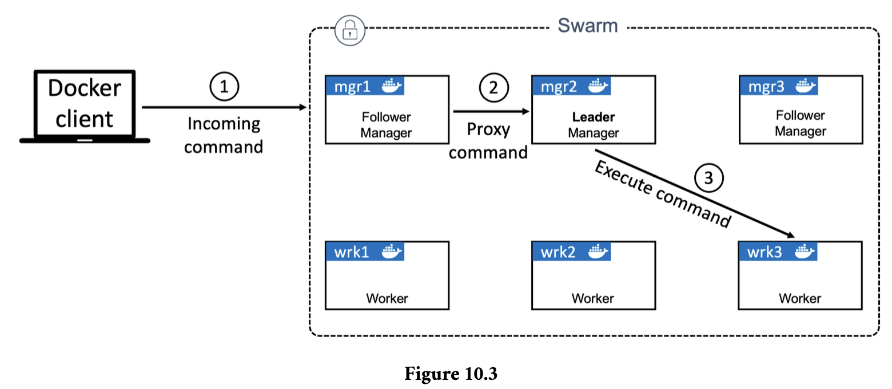
`Step 1` is the command coming into a manager
from a remote Docker client.

`Step 2` is the non-leader manager receiving the command
and proxying it to the leader.

`Step 3` is the leader executing the command on the swarm.

On the topic of HA, the following two best practices apply:

1. Deploy an odd number of managers
2. Don’t deploy too many managers (3 or 5 is recommended)
3. Spread managers across availability zones

**Having an odd number of managers reduces the chances of split-brain conditions.**

For example, if we had 4 managers and the network partitioned, we could be left with two
managers on each side of the partition. This is known as a `split brain`

**It’s a best practice to have either 3 or 5 managers for HA.**

### Locking a Swarm

Docker allows you to lock a swarm with the Autolock
feature. This forces restarted managers to present a key before being admitted back into
the cluster.

It’s possible to lock a swarm as part of the initialization process by passing the --autolock flag to the docker swarm init command.

**You can always check your current
swarm unlock key with the docker swarm unlock-key command.**

Restart one of your manager nodes to see if it automatically re-joins the cluster. You
may need to prefix the command with sudo.
$ service docker restart

docker swarm unlock
Please enter unlock key: <enter your key>

**Locking your swarm and protecting the unlock key is recommended for production
environments.**

**In production environments it’s common to configure swarms so that only workers execute user applications. This allows managers to focus solely on control-plane duties.**

Run the following three commands from any manager to prevent all three managers
from running application containers.

- $ docker node update --availability drain mgr1
- $ docker node update --availability drain mgr2
- $ docker node update --availability drain mgr3

### Deploying Swarm services

You can create services in one of two ways:

1. Imperatively on the command line with docker service create
2. Declaratively with a stack file

```note
$ docker service create --name web-fe \
-p 8080:8080 \
--replicas 5 \
nigelpoulton/ddd-book:web0.1
z7ovearqmruwk0u2vc5o7ql0p
overall progress: 5 out of 5 tasks
1/5: running [==================================================>]
2/5: running [==================================================>]
3/5: running [==================================================>]
4/5: running [==================================================>]
5/5: running [===========
```

The docker service create command tells Docker to deploy a new service. We used the --name flag to name it `web-fe`. We told Docker to map port 8080 on every swarm
node to 8080 inside of each service replica (container). Next, we used the --replicas flag to tell Docker there should always be 5 replicas of this service. Finally, we told Docker which image to base the replicas on — it’s important to understand that all service replicas use the same image and config.

`Terminology` : Services deploy containers, and we often call these containers replicas. For example, a service that deploys three replicas will deploy three
identical containers.

The command was sent to a manager node and the leader manager instantiated 5 replicas across the swarm. Managers on this swarm aren’t allowed to run application containers, meaning all 5 replicas are deployed to worker nodes.

**if a worker hosting one of the 5 replicas fails, the observed state of the service will drop from 5 replicas to 4 and will no longer match the desired state of 5. As
a result, the swarm will start a new replica to bring the observed state back in line with desired state. We call this reconciliation or self-healing and it’s a key tenet of cloud-native applications.**

### Viewing and inspecting services

**To list all the services that are running on the swarm**

```note
ubuntu@mgr2:~$ docker service ls
ID NAME MODE REPLICAS IMAGE PORTS
baaqcfumms91 web-fe replicated 5/5 nigelpoulton/ddd-book:web0.1 \*:8080->8080/tcp
```

To list all service replicas

```note
ubuntu@mgr2:~$ docker service ps web-fe
ID             NAME       IMAGE                          NODE      DESIRED STATE   CURRENT STATE           ERROR     PORTS
hqruxsqidypv   web-fe.1   nigelpoulton/ddd-book:web0.1   wrk2      Running         Running 8 minutes ago
5dx3c90zbu1l   web-fe.2   nigelpoulton/ddd-book:web0.1   wrk3      Running         Running 8 minutes ago
deb74xv7jpxr   web-fe.3   nigelpoulton/ddd-book:web0.1   wrk1      Running         Running 8 minutes ago
g6pw3hipnu96   web-fe.4   nigelpoulton/ddd-book:web0.1   wrk2      Running         Running 8 minutes ago
mqhw745c94gd   web-fe.5   nigelpoulton/ddd-book:web0.1   wrk3      Running         Running 8 minutes ago
```

For detailed information about a service, use the `docker service inspect` command.

### Replicated vs global services

`Replicated` : deploys a desired number
of replicas and distributes them as evenly as possible across the cluster.

`Global` : This runs a single replica on every node in the swarm.

### Scaling a service

Another powerful feature of services is the ability to easily scale them up and down.

If business is booming and we’re seeing double the amount of traffic hitting the web front-end, we can easily scale the service up with the docker
service scale command.

$ docker service scale web-fe=10

Behind the scenes, Swarm runs a scheduling algorithm called `spread` that attempts to balance replicas as evenly as possible across available nodes.

### Removing services

$ docker service rm web-fe
web-fe

### Rolling Updates

Well… thanks to Docker services, pushing updates to well-designed microservices apps is easy.

To see a rollout, create a new network and then deploy the service

$ docker network create -d overlay uber-net
43wfp6pzea470et4d57udn9ws

The uber-net network was successfully created with the swarm scope and is currently only visible on manager nodes in the swarm. It will be dynamically extended to worker nodes when they run workloads that use it.

Let’s create a new service and attach it to the uber-net network.

```note
docker service create --name uber-svc \
--network uber-net \
-p 8080:8080 --replicas 12 \
nigelpoulton/ddd-book:web0.1
```

This mode of publishing a port on every node in the swarm — even nodes not running service replicas — is called `ingress mode` and is the default.

`host mode` : which only publishes the service on swarm nodes running replicas.

hat you’ve been tasked with pushing the updated image to the swarm in a staged manner — 2 replicas at a time with a 20 second delay between each. You can
use the following docker service update command to accomplish this.

$ docker service update \
--image nigelpoulton/ddd-book:web0.2 \
--update-parallelism 2 \
--update-delay 20s \
uber-svc

Congratulations. You’ve just completed a zero-downtime rolling update to a live containerized application.

### TroubleShooting

Swarm Service logs can be viewed with the docker service logs command.

By default, Docker nodes configure services to use the json-file log driver, but other
drivers exist, including:

- awslogs
- gelf
- gcplogs
- journald (only works on Linux hosts running systemd)
- splunk
- syslog

The format of the command is `docker service logs
<service-name>`.

### Backing up and recovering a Swarm

Storing configuration objects outside of the
swarm in a version control repository will give you the option to redeploy things like `networks, services, secrets, and other objects`.

Swarm configuration and state is stored in `/var/lib/docker/swarm` on every manager node.A
`swarm backup` is a copy of all the files in this directory.

it’s a good idea to perform the backup from a non-leader manager. This is because stopping Docker on the leader will initiate a `leader election`.

backup at a quiet time for the business, as stopping managers increases the risk of the swarm losing quorum if another manager fails during the backup.

1. Stop Docker on a non-leader manager.

$ service docker stop

2. Backup the Swarm config.

$ tar -czvf swarm.bkp /var/lib/docker/swarm/

3. Verify the backup file exists.

$ ls -l
-rw-r--r-- 1 root root 450727 May 22 12:34 swarm.bkp

4. Restart Docker.

$ service docker restart

5. Unlock the Swarm to admit the restarted manager.

### Recovering a Swarm

Restoring a Swarm from backup is only for situations where the swarm is corrupted, or otherwise lost, and you cannot recover objects from copies of config files.

The following requirements must be met for a recovery operation to work:

1. You can only restore to a node running the same version of Docker the backup was

2. performed on
   You can only restore to a node with the same IP address as the node the backup
   was performed on

- Stop Docker on the manager.

$ service docker stop

- Delete the Swarm config.

$ rm -r /var/lib/docker/swarm

At this point, the manager is down and ready for the restore operation.

- Restore the Swarm configuration from the backup file and verify the files recover
  properly.

$ tar -zxvf swarm.bkp -C /

$ ls /var/lib/docker/swarm
certificates docker-state.json raft state.json worker

- Start Docker.

$ service docker start

- Unlock your Swarm with your Swarm unlock key.

$ docker swarm unlock
Please enter unlock key: <your key>

- Initialize a new swarm with the configuration from the backup. Be sure to use the appropriate IP address for the node you’re performing the restore operation on.

$ docker swarm init --force-new-cluster \
--advertise-addr 10.0.0.1:2377 \
--listen-addr 10.0.0.1:2377
Swarm initialized: current node (jhsg...3l9h) is now a manager.

### Docker Swarm - The Commands

- `docker swarm init` is the command to create a new swarm.

- `docker swarm join-token` reveals the commands and tokens needed to join
  workers and managers to a swarm.

- `docker node ls` lists all nodes in the swarm, including which are managers and which is the leader.

- `docker service create` is the command to create a new service.

- `docker service ls` lists running services and gives basic info on the state of the service and any replicas it’s running.

- `docker service ps <service>` gives more detailed information about individual service replicas.

- `docker service inspect` gives very detailed information on a service.

- `docker service scale` lets you scale the number of replicas in a service up and
  down.

- `docker service update` lets you update many of the properties of a running
  service.

- `docker service logs` lets you view the logs of a service.

- `docker service rm` is the command to delete a service from the swarm.

### Docker Networking

no network, no app!

#### Docker Networking - The TLDR

Docker runs applications inside of containers, and applications need to communicate with other application.So Docker needs strong networking capabilities.

Docker networking is based on an open-source pluggable architecture called the
Container Network Model (CNM).`libnetwork` is the reference implementation of the CNM, and it provides all of Docker’s core networking capabilities.

Drivers plug-in to libnetwork to provide specific network topologies.

Docker Networking - The Deep Dive
We’ll organize this section of the chapter as follows:

- The theory
- Single-host bridge networks
- Multi-host overlay networks
- Connecting to existing networks
- Service Discovery
- Ingress load balancing

### The theory

Docker networking comprises three major components:

- The Container Network Model (CNM)
- Libnetwork
- Drivers

`CNM` is the design specification and outlines the fundamental building blocks of a Docker network.

`Libnetwork` is a real-world implementation of the CNM. It’s open-sourced as part of the Moby project and used by Docker and other projects.

`Drivers` extend the model by implementing specific network topologies such as VXLAN
overlay networks.

### The Container Network Model (CNM)

The design guide for Docker networking is the CNM.

It defines three building blocks:

- Sandboxes
- Endpoints
- Networks

`sandbox` is an isolated network stack in a container. It includes Ethernet interfaces,
ports, routing tables and DNS config.

`Endpoints` are virtual network interfaces (E.g. veth).Like normal network interfaces,these are responsible for making connections. For example, endpoints to connect sandboxes to networks.

`Networks` are a software implementation of a switch (802.1d bridge). As such, they group
together and isolate a collection of endpoints that need to communicate.

Container Network Model is all about providing networking for containers.

sandboxes are placed inside of
containers to provide network connectivity.

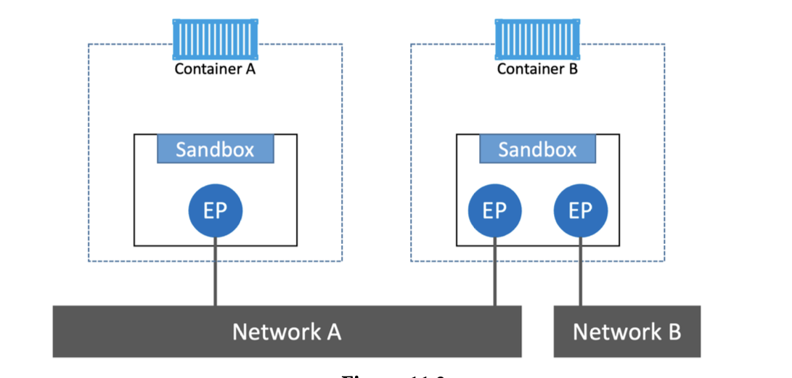

Container A has a single interface (endpoint) and is connected to Network A. Container
B has two interfaces (endpoints) and is connected to Network A and Network B.
The two containers can communicate because they are both connected to Network A.

However, the two endpoints in Container B cannot communicate with each other without the assistance of a layer 3 router.

**endpoints behave like regular network adapters,
meaning they can only be connected to a single network.**

### Libnetwork

The CNM is the design doc and libnetwork is the canonical implementation.

Earlier all the networking code existed in docker daemon where there is no modularity,so got ripped out and refactored into an external library called `libnetwork` based on the principles of the CNM.

libnetwork also implements native service discovery, ingress-based container load balancing, and the network control plane and management plane.

### Drivers

If libnetwork implements the control plane and management plane, then drivers implement the data plane.For example, connectivity and isolation is all handled by drivers.

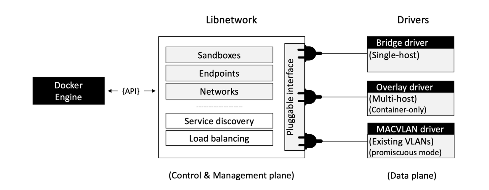

Docker ships with several built-in drivers, known as `native drivers or local drivers`. These
include `bridge, overlay, and macvlan`.

Every network is owned by a driver.an overlay network called “prod-fe-cuda” will be owned and managed by the overlay driver.

### Single-host bridge networks

The simplest type of Docker network is the `single-host bridge network`.

- Single-host tells us it only spans a single Docker host and can only connect containers that are on the same host.

- Bridge tells us that it’s an implementation of an 802.1d bridge (layer 2 switch).

`On Linux` : built in bridge driver
`On windows` : built in nat driver
For all intents and purposes, they work the same.

The default “bridge” network, on all Linux-based Docker hosts, maps to an underlying
Linux bridge in the kernel called `docker0`.

Let’s use the docker network called “localnet”.
network

$ docker network create -d bridge localnet

Let’s create a new container and attach it to the new localnet bridge network.

$ docker run -d --name c1 \
--network localnet \
alpine sleep 1d

**If we add another new container to the same network, it will be able to ping the “c1”
container by name.containers automatically register with the embed-
ded Docker DNS service, allowing them to resolve the names of all other containers on
the same network.**

1. Create a new interactive container called “c2” and put it on the same localnet
   network as “c1”.

$ docker run -it --name c2 \
--network localnet \
alpine sh

Your terminal will switch into the “c2” container.

2. From within the “c2” container, ping the “c1” container by name.

> ping c1
> Pinging c1 [172.26.137.130] with 32 bytes of data:
> Reply from 172.26.137.130: bytes=32 time=1ms TTL=128
> Reply from 172.26.137.130: bytes=32 time=1ms TTL=128
> Control-C

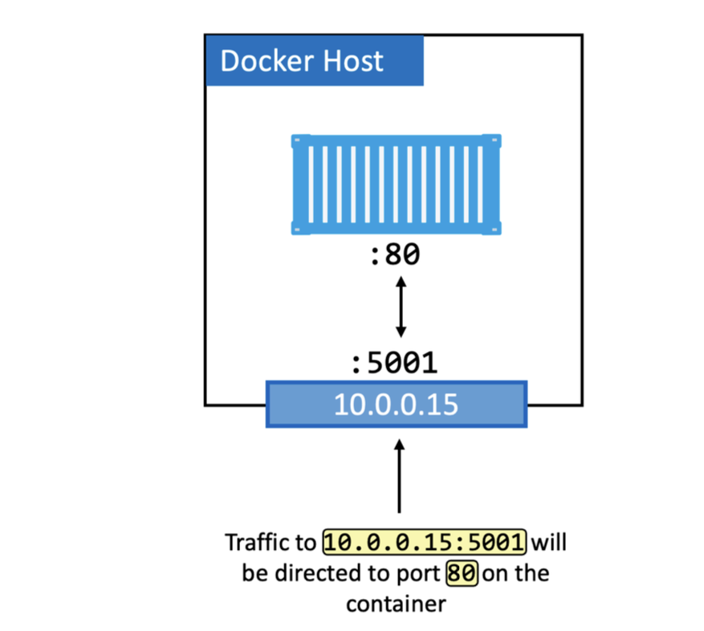

In the diagram, the application running in the container is operating on port 80. This is
mapped to port 5001 on the host’s 10.0.0.15 interface. The result is all traffic hitting
the host on 10.0.0.15:5001 being redirected to the container on port 80.

$ docker run -d --name web \
--network localnet \
--publish 5001:80 \
nginx

**only a
one container can bind to any particular port on the host. In our example, no other
containers will be able to bind to port 5001. This is one of the reason’s that single-host
bridge networks are only useful for local development and very small applications.**

### Multi-host overlay networks

Overlay networks are multi-host.

a single network can span every node in a swarm, allowing containers on different hosts to communicate. They’re great for container-to-container communication and they scale well.

Docker provides a native driver for overlay networks.creating them as
simple as adding the `-d overlay` flag to the docker network create command.

### Connecting to existing networks

The containerized parts need a way to communicate with the parts still running on existing physical networks and VLANs.

**The built-in MACVLAN driver (transparent on Windows) was created with this in mind.**
It gives each container its own IP and MAC address on the external physical network,
making them look just like a physical server or VM.

Its good as it doesn't require port mappings or additional bridges.

MACVLAN is great in private data centers where you control the network and can enable promiscuous mode.

But in public clouds or strict corporate networks, it likely won’t work because promiscuous mode is not allowed.

### Container and Service logs for troubleshooting

If you think you’re experiencing connectivity issues between containers, it’s worth
checking the `Docker daemon logs` as well as `container logs`.

`Docker daemon logs:`
The following snippet from a daemon.json enables debugging and sets the level to
debug. It will work on all Docker platforms.

```note
{
<Snip>
"debug":true,
"log-level":"debug",
<Snip>
}
```

`Container logs:`
Logs from standalone containers can be viewed with the docker logs command

Every Docker host has a default
logging driver and configuration for containers. Some of the drivers include:

- json-file (default)
- journald (only works on Linux hosts running systemd)
- syslog
- splunk
- gelf

You can configure an individual container, or service, to start with a particular logging
driver with the --log-driver and --log-opts flags. These will override anything set in
daemon.json.

{

"log-driver": "syslog"

}

### Service discovery

Service discovery allows all containers and Swarm services to locate each other by name. The only requirement is that they be on the same network.This leverages Docker’s embedded DNS server and the DNS resolver in each container.

- `Step 1`: The ping c2 command invokes the local DNS resolver to resolve the name “c2” into an IP address. All Docker containers have a local DNS resolver.

- `Step 2`: If the local resolver doesn’t have an IP address for “c2” in its local cache, it initiates a recursive query to the Docker DNS server. The local resolver is preconfigured to know how to reach the Docker DNS server.

- `Step 3`: The Docker DNS server holds name-to-IP mappings for all containers created with the --name or --net-alias flags. This means it knows the IP address of container “c2”.

- `Step 4`: The DNS server returns the IP address of “c2” to the local resolver in container “c1”. It does this because the two containers are on the same network if they were on different networks this would not work.

- `Step 5`: The ping command issues the ICMP echo request packets to the IP address
  of “c2”.

Every Swarm service and standalone container started with the `--name flag` will register
its name and IP with the Docker DNS service.However, service discovery is network-scoped, meaning name resolution only works for containers and Services on the same network.

### Ingress load balancing

Services published via `ingress mode` can be accessed from any node in the Swarm even nodes not running a service replica. Services published via host mode can only be accessed by hitting nodes running service replicas.

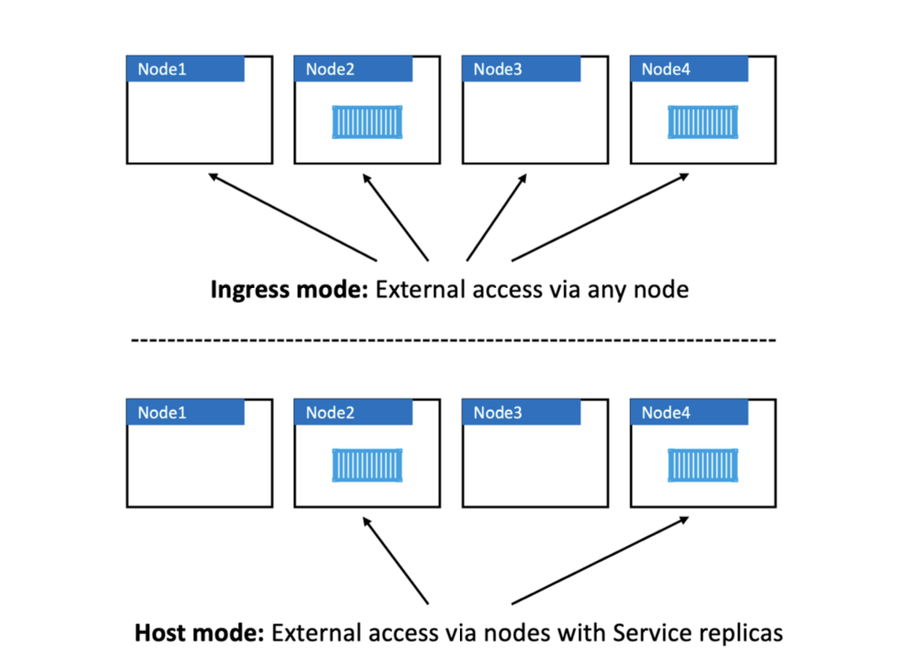

Ingress mode is default.To publish a service in host mode you need to use the long format of the --publish flag and add mode=host. The following example uses host mode.

```note
$ docker service create -d --name svc1 \
--publish published=5001,target=80,mode=host \
nginx
```

mode=host makes sure requests will only reach the service if they arrive on nodes
running a service replica.

Behind the scenes, ingress mode uses a `layer 4` routing mesh called the `service mesh` or
the `swarm-mode service` mesh. Below figure shows the basic traffic flow of an external request hitting the cluster for a service exposed in ingress mode.

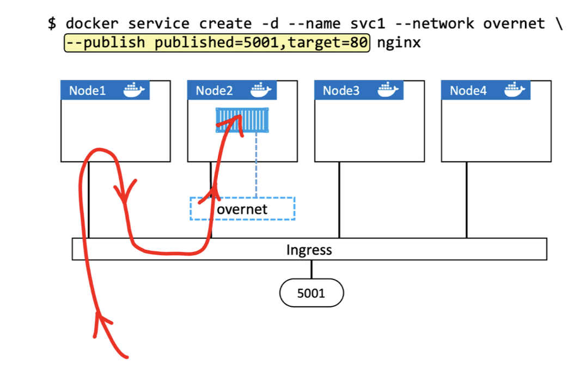

1. The command at the top deploys a new Swarm service called “svc1”. It’s attaching the service to the overnet network and publishing it on port 5001.

2. Publishing a Swarm service like this (--publish published=5001,target=80) will publish it on the ingress network. As all nodes in a Swarm are attached to the ingress network meaning the port is published swarm-wide.

3. Logic is implemented on the cluster ensuring that any traffic hitting the ingress network, via any node, on 5001 will be routed to the “svc1” replicas on port 80.

4. At this point, a single replica for the “svc1” service is deployed.

5. The red line shows traffic hitting node1 on the published port and being routed to
   the service replica running on node2 via the ingress network.

**It’s also important to know that if there are multiple replicas, as shown in Figure 11.21,
traffic will be balanced across them all.**

### Docker Networking - The Commands

- `docker network ls`: Lists all networks on the local Docker host.

- `docker network create`: Creates new Docker networks. By default, it creates them with the `nat driver on Windows` and the `bridge driver on Linux`. You can specify the driver (type of network) with the -d flag. docker network create -d
  overlay overnet will create a new overlay network called overnet with the native
  Docker overlay driver

- `docker network inspect`: Provides detailed configuration information about a Docker network. Same as docker inspect.

- `docker network prune`: Deletes all unused networks on a Docker host.

- docker network rm: Deletes specific networks on a Docker host.

### Chapter Summary

- The Container Network Model (CNM) is the design document for Docker networking
  and defines the three major constructs that are used to build Docker networks `sandboxes, endpoints, and networks`.

- `libnetwork` is the reference implementation of the CNM. It’s an open-source project
  that lives in the Moby project. It’s used by Docker and is where all of the core Docker networking code lives. It also provides network control plane and management plane services such as service discovery.

- Drivers extend libnetwork by implementing specific network types such as bridge
  networks and overlay networks. Docker ships with built-in drivers, but you can also use
  3rd-party drivers.

- `Single-host bridge` networks are the most basic type of Docker network and are suitable
  for local development and very small applications.They do not scale and they require port mappings if you want to publish your services outside of the network.

- Overlay networks are all the rage and are excellent container-only multi-host networks.
  We’ll talk about them in-depth in the next chapter.

- The macvlan driver allows us to connect containers to existing physical networks and
  VLANs. They make containers first-class citizens by giving them their own MAC and
  IP addresses. Unfortunately, they require promiscuous mode on the host NIC, meaning
  they won’t work in the public cloud.

- Docker also uses libnetwork to implement service discovery and an ingress routing mesh for container-based load balancing of ingress traffic.

### 12: Docker overlay networking

Overlay networks are at the center of most cloud-native microservices apps.

Containers on different hosts can connect to the same overlay network and communicate directly.

### Building and testing Docker overlay networks

The first thing to do is configure the two nodes into a swarm. This is because swarm mode is a pre-requisite for Docker overlay networks.

Run the following command on node1.

```note
$ docker swarm init \
--advertise-addr=172.31.1.5 \
--listen-addr=172.31.1.5:2377

Swarm initialized: current node is now a manager.
```

Copy the docker swarm join command included in the output and paste it into a terminal on node2.

```note
$ docker swarm join \
--token SWMTKN-1-0hz2ec...2vye \
172.31.1.5:2377
This node joined a swarm as a worker.

We now have a two-node Swarm with node1 as a manager and node2 as a worker.
```

#### Create a new overlay network

$ docker network create -d overlay uber-net
c740ydi1lm89khn5kd52skrd9

You’ve just created a brand-new overlay network that’s available to all hosts
in the swarm and has its control plane encrypted with TLS

`control plane traffic` is cluster management traffic.

`data plane traffic` is application traffic.
Docker overlay networks encrypt cluster management traffic but not application traffic.
You must explicitly enable encryption of application traffic with `-o encrypted flag`

### Attach a service to the overlay network

```note
$ docker service create --name test \
--network uber-net \
--replicas 2 \
ubuntu sleep infinity
```

The command creates a new service called test and attaches both replicas to the uber-
net overlay network.

Standalone containers that are not part of a swarm service cannot attach to overlay networks unless the network was created with the attachable=true property.

Congratulations. You’ve created a new overlay network spanning two nodes on separate
physical underlay networks. You’ve also attached two containers to it. How easy was
that!

### Test the overlay network

Run a docker inspect to see the subnet assigned to the overlay and the IP addresses
assigned to the two test service replicas.

```note
$ docker exec -it 396c8b142a85 bash

# apt-get update && apt-get install iputils-ping -y
<Snip>
Reading package lists... Done
Building dependency tree
Reading state information... Done
<Snip>
Setting up iputils-ping (3:20190709-3) ...
Processing triggers for libc-bin (2.31-0ubuntu9) ...


# ping 10.0.0.4
PING 10.0.0.4 (10.0.0.4) 56(84) bytes of data.
64 bytes from 10.0.0.4: icmp_seq=1 ttl=64 time=1.06 ms
64 bytes from 10.0.0.4: icmp_seq=2 ttl=64 time=1.07 ms
64 bytes from 10.0.0.4: icmp_seq=3 ttl=64 time=1.03 ms
64 bytes from 10.0.0.4: icmp_seq=4 ttl=64 time=1.26 ms
^C
```

The container on node1 can ping the container on node2 via the overlay network.If you created the network with the -o encrypted flag, the exchange
will have been encrypted.

**So far, we’ve created an overlay network with a single command. Then we added containers to it. The containers were scheduled on two hosts on two different layer 2 underlay networks. We located the container’s IP addresses and proved they could
communicate directly via the overlay network.**

### Overlay networks explained

Docker overlay networking uses `VXLAN tunnels` to create virtual layer 2 overlay networks.

### VXLAN primer

VXLANs let you create layer 2 networks on top of an existing layer 3 infrastructure.

The beauty of VXLAN is that it’s an encapsulation technology. This means existing routers and network infrastructure just see it as regular IP/UDP packets and handle without requiring any changes.

To create the overlay, a `VXLAN tunnel` is created through the `underlay networks`.The tunnel is what allows traffic to flow freely without having to interact with the complexity of the underlay networks.

Each end of the VXLAN tunnel is terminated by a `VXLAN Tunnel Endpoint (VTEP)`.It’s this VTEP that encapsulates and de-encapsulates the traffic entering and exiting the tunnel.

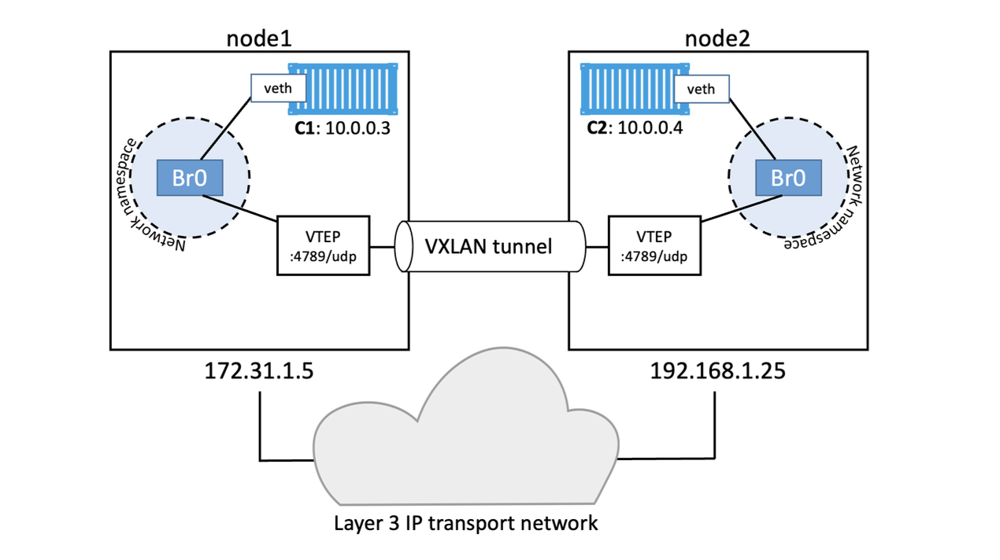

This image shows the layer 3 infrastructure as a cloud for two reasons:

- It can be a lot more complex than two networks and a single router as shown in
  previous diagrams
- The VXLAN tunnel abstracts the complexity and makes it opaque

### Walk through our two-container example

examples from earlier had two hosts connected via an IP network. Each host ran a single container and you created a single overlay network for the containers.

What happened inside is:

- A new sandbox (network namespace) was created on each host.

A virtual switch called Br0 was created inside the sandboxes. A VTEP is also created
with one end plumbed into the Br0 virtual switch and the other end plumbed into
the host network stack. The end in the host network stack gets an IP address on the
underlay network the host is connected to and is bound to a UDP socket on port 4789.
The two VTEPs on each host create the overlay via a VXLAN tunnel

Each container then gets its own virtual Ethernet (veth) adapter that is also plumbed into the local Br0 virtual switch.

Docker overlay networking - The commands

- docker network create is the command we use to create a new container network. The -d flag specifies the driver to use, and the most common driver is `overlay`.For overlay networks, the control plane is encrypted by default. You can encrypt the data plane by adding the -o encrypted flag but performance overhead might be incurred.

- `docker network ls` lists all of the container networks visible to a Docker host.
  Docker hosts running in swarm mode only see overlay networks if they are running
  containers attached to those networks. This keeps network-related gossip to a minimum.

- docker network inspect shows detailed information about a particular container
  network. This includes scope, driver, IPv4 and IPv6 info, subnet configuration, IP
  addresses of connected containers, VXLAN network ID, and encryption state.
- docker network rm deletes a network

### 13: Volumes and persistent data

`Persistent` is the data we need to keep. Things like customer records, financial data,research results, audit logs, and even some types of application log data.

`Non-persistent` is the data we don’t need to keep.To deal with this, every Docker container gets its own `non-persistent storage`.This is automatically created for every container and is `tightly coupled` to the lifecycle of the container. As a result, deleting the container will delete the storage and
any data on it.

To deal with persistent data, containers need to store it in a `volume`. Volumes are separate
objects that have their lifecycles `decoupled from containers`. This means you can create
and manage volumes independently, and they don’t get deleted when their container is
deleted.

### Containers and non-persistent data

Containers are designed to be immutable.This is jargon that means read-only.You should
never log into a running container and make configuration changes.

However, many applications require a `read-write` filesystem in order to run – they won’t
even run on a read-only filesystem.

Containers created by Docker have a thin read-
write layer on top of the read-only images they’re based on.These include `local storage, ephemeral storage, and graphdriver storage`.

This thin writable layer is an integral part of many containers and enables all read/write
operations.If you, or an application, update files or add new files, they’ll be written
to this layer.However, it’s tightly coupled to the container’s lifecycle.The fact
that it’s deleted along with a container means it’s not an option for important data that
you need to keep (persist).

### Containers and persistent data

Volumes are the recommended way to persist data in containers.

- Volumes are independent objects that are not tied to the lifecycle of a container
- Volumes can be mapped to specialized external storage systems
- Volumes enable multiple containers on different Docker hosts to access and share the same data

At a high-level, you create a `volume`, then you create a `container` and mount the volume
into it.It is mounted in the directory of the container's filesystem, anything written to that directory is stored in the volume.

If you delete the container, the volume and its data will still exist.

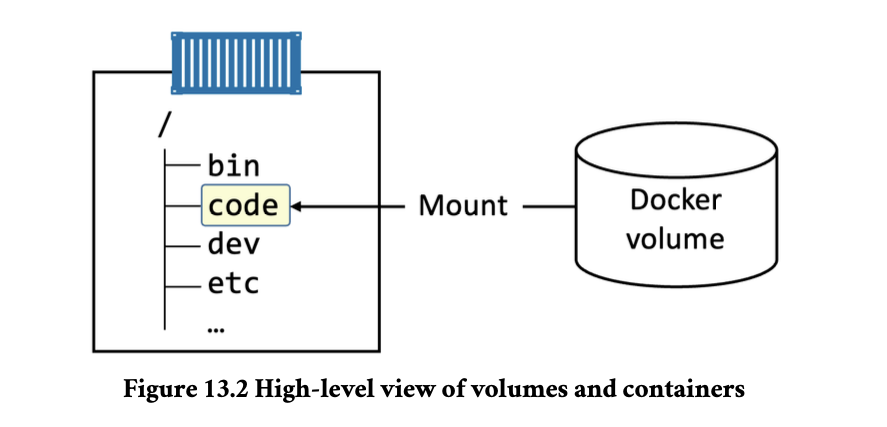

Docker volume existing outside of the container as a separate object.
It is mounted into the container’s filesystem at /data, and any data written to the /data
directory will be stored on the volume and will exist after the container is deleted.

### Creating and managing Docker volumes

Volumes are first-class objects in Docker.Meaning they are their own object in the API and have their own docker volume sub-command.

```note
$ docker volume create myvol
myvol
```

By default, Docker creates new volumes with the built-in `local driver`,as name suggests, they are only available to container on the same node as the volumes.

use the `-d flag` to specify a different driver.

```note
ubuntu@wrk1:~$ docker volume inspect myvol
[
    {
        "CreatedAt": "2025-08-06T14:25:13-04:00",
        "Driver": "local",
        "Labels": null,
        "Mountpoint": "/var/lib/docker/volumes/myvol/_data",
        "Name": "myvol",
        "Options": null,
        "Scope": "local"
    }
]
```

Notice that the Driver and Scope are both `local`. This means the volume was created with the local driver and is only available to containers on this Docker host.

The `Mountpoint property` tells us where in the Docker host’s filesystem the volume exists.

There are two ways to delete a Docker volume:

- docker volume prune
- docker volume rm

Neither command will delete a volume that is in use by a container or service replica.

As a result, defining a volume in a Dockerfile requires you to specify host directories at
deploy-time otherwise build fails.

### Demonstrating volumes with containers and services

$ docker run -it --name voltainer \
--mount source=bizvol,target=/vol \
alpine

create a new standalone container that mounts a volume called bizvol.

- If you specify an existing volume, Docker will use the existing volume
- If you specify a volume that doesn’t exist, Docker will create it for you

Although containers and volumes have separate lifecycle’s, you cannot delete a volume
that is in use by a container.

Although containers and volumes have separate lifecycle’s, you cannot delete a volume
that is in use by a container. Try it.

$ docker volume rm bizvol

Error response from daemon: remove bizvol: volume is in use - [b44d3f82...dd2029ca]

Even though the container is deleted, the volume still exists:

It’s even possible to mount the bizvol volume into a new service or container.

### Potential data corruption

A major concern with any configuration that shares a single volume among multiple containers is data corruption.

However, before ctr-1 on node1 flushes its buffers and commits the data to the volume, the app in ctr-
2 on node2 updates the same data with a different value and commits it directly to the
volume. At this point, both applications think they’ve updated the data in the volume,
but in reality, only the application in ctr-2 has. A few seconds later, ctr-1 on node1
flushes the data to the volume, overwriting the changes made by the application in ctr- 2. However, the application in ctr-2 is totally unaware of this! This is one of the ways
data corruption happens.

### Volumes and persistent data - The Commands

- `docker volume create` is the command to create new volumes. By default, volumes are created with the local driver but you can use the -d flag to specify a different driver.

- `docker volume ls` will list all volumes on the local Docker host.

- `docker volume inspect` shows detailed volume information. Use this command
  to see many interesting volume properties, including where a volume exists in the
  Docker host’s filesystem.

- `docker volume prune` will delete all volumes that are not in use by a container or
  service replica. Use with caution!

- `docker volume rm` deletes specific volumes that are not in use.

- `docker plugin install` installs new volume plugins from Docker Hub.

- `docker plugin ls` lists all plugins installed on a Docker host.

`Volumes` are the recommended way to work with persistent data in a Docker environment.

### Deploying apps with Docker Stacks - The TLDR

They let you define complex multi-service
apps in a single declarative file.

They also provide a simple way to deploy and manage
entire application lifecycles — initial deployment > health checks > scaling > updates >
rollbacks and more.

The process is simple. Define what you want in a `Compose file` which includes entire stack of the microservices that make up the app and deploy and manage it with the `docker stack` command. That’s it!

It also includes infrastructure such as `volumes, networks, secrets, and more`.

Docker is great for application development and testing. Docker Stacks are great for scale and production.

### Deploying apps with Docker Stacks - The Deep Dive

stacks are at the top of the Docker application
hierarchy. They build on top of services, which in turn build on top of containers.

### Overview of the sample app

For the rest of the chapter, we’ll be using an application with two services, an encrypted
overlay network, a volume, and a port mapping.

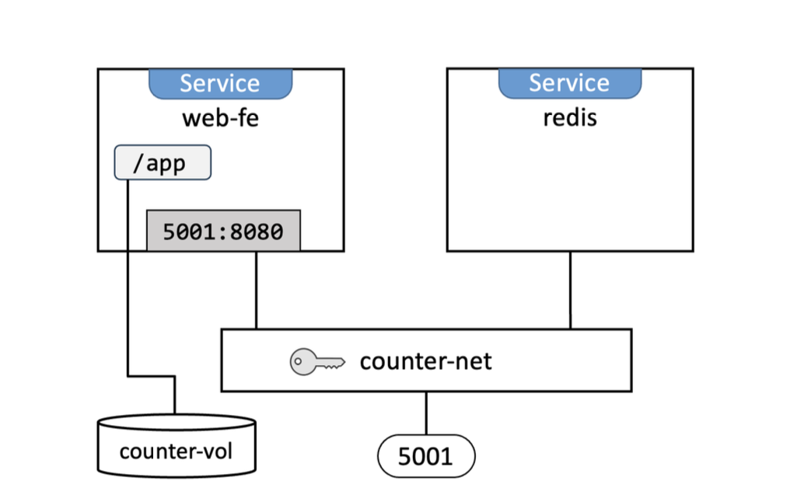

**When referring to services we’re talking about the Docker service object that is one or more identical containers managed as a single
object on a swarm cluster.**

At the highest level, the Compose defines `3 top-level keys`.
networks:
volumes:
services:

`Networks` defines the networks required by the app.

`volumes` defines volumes

`services` is where you define the microservices that make up the app.

### Looking closer at the stack file

Stacks don’t support building images from Dockerfiles but Compose does.

One of the first things Docker does when deploying an app from a stack file is `create the
required networks` listed under the networks key. If the networks don’t already exist,
Docker creates them.

### Networks and networking

```note
networks:
counter-net:
driver: overlay
driver_opts:
encrypted: 'yes'
```

It needs to be an `overlay network` so it can span all nodes in the swarm.

### Volumes and mounts

The app defines a single volume called counter-vol and mounts it into the /app/
directory on all redis replicas. Any read or write operations to the /app folder will be
read and written to the volume.

```note
volumes:
counter-vol:
services:
redis:
<Snip>
volumes:
- type: volume
source: counter-vol
target: /app
```

### Services

#### The web-fe service

the web-fe service defines an image, an app, a replica count, an update
configuration, a restart policy, a network, a published port, and a volume.

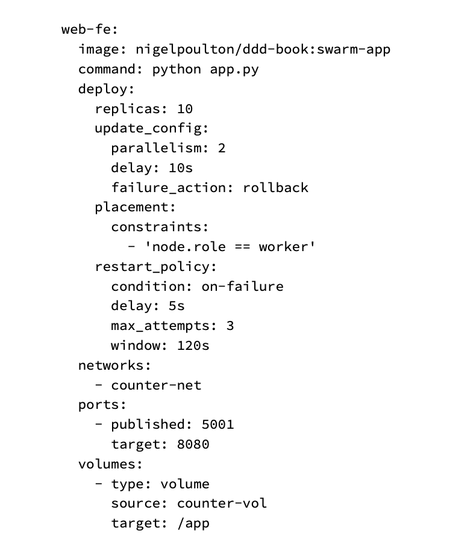
`The image key` is the only mandatory key in the service object and it defines the image used to build the `service replicas`. Remember, a service is `one or more identical containers`.

We can pull images from third party registry.For example, adding `gcr.io` before an image name will pull it from Google’s container registry.

Docker Stacks and Docker Compose is that stacks don’t support `builds`.

`command key` defines the app to run in each replica.

`deploy.replicas` key is telling swarm to deploy and manage 4 service replicas. All
replicas are identical other than names and IPs.

**re-deploying a stack does not affect services that you haven’t made a change to.**

`deploy.update_config` block says to perform updates by updating two replicas at a time, wait 10 seconds in between each set, and perform a rollback if the update encounters a problem.

The other options for deploy.update_config are pause and continue.

`deploy.placement` block forces all replicas onto worker nodes.

`deploy.restart_policy` block says to restart replicas if they fail. It also says to try a
maximum of 3 times, wait 5 seconds in-between each restart attempt, and wait up to
120 seconds to decide if the restart worked.

`networks key` tells swarm to attach all replicas to the counter-net network.

`ports block` publishes the app on the ingress network on port 5001 and the counter-
net network on 8080. This ensures traffic hitting the swarm on 5001 gets redirected to
the service replicas on 8080.

`volumes` block mounts the counter-vol volume into /app in each service
replica.

### The redis service

The redis service is much simpler. It pulls the redis:alpine image, starts a single
replica, and attaches it to the counter-net network. This is the same network as the
web-fe service, meaning the two services will be able to communicate with each other
by name (“redis” and “web-fe”).

redis:
image: "redis:alpine"
networks:
counter-net:

Compose files are a great source of application documentation.

### Deploying the app

We’ll deploy the app as a `Docker Stack`. This means our Docker nodes need to be configured as a swarm.

### Building a lab for the sample app

1. Initialize a new Swarm.

$ docker swarm init

2. Add worker nodes.

3.Verify that the Swarm is configured with one manager and two workers.

The Swarm is now ready. Let’s deploy the stack.

### Deploying the sample app

Stacks are deployed using the docker accepts two arguments:

- name of the stack file
- name of the stack

$ docker stack deploy -c compose.yaml ddd

The networks and volumes were created before the services. This is because services use
these and will fail to start if they don’t exist.

You can verify the status of the stack with below

$ docker stack ls
NAME SERVICES
ddd 2

`docker stack ps` command is a good place to start when troubleshooting services that fail to start.

```note
$ docker stack ps ddd
NAME NODE DESIRED CURRENT ERROR
web-fe.1 wrk-2 Shutdown Failed "task: non-zero exit (1)"
\_web-fe.1 wrk-2 Shutdown Failed "task: non-zero exit (1)"
```

`docker service logs` command for more detailed logs. You pass it the service name or ID, or a replica ID. If you pass it the service name or ID, you’ll get the logs for all service replicas. If you pass it a particular replica ID, you’ll only get the logs for that replica.

Now that the stack is up and running, let’s see how declaratively manage it.

### Managing a stack

We know a stack is a set of related services and infrastructure that gets deployed and
managed as a unit.

The recommended method is the **declarative method**. This uses the stack file as the
ultimate source of truth and demands that all changes be made by updating the stack
file and redeploying the app from the updated file.

`Drawback of imperative method` if we use the docker service scale command scale up to 10 in order to meet increased demand, the current state of the app will no longer match the
Compose file.

We’ll make the following changes:

- Increase the number of web-fe replicas from 4 to 10
- Update the app based on a newer image called :swarm-appv2

Update the compose.yaml file to reflect the changes.

```note
Snip>
services:
web-fe:
image: nigelpoulton/ddd-book:swarm-appv2 command: python app.py
deploy:
replicas: 4 <<---- Changed from 4 to 10
<Snip>
```

Save the file and redeploy the app.

Two things happened when we re-deployed the stack:

- The web-fe service was scaled up from 4 replicas to 10
- The web-fe service was changed to use the swarm-appv2 image

**Docker treats replicas as immutable objects and never
makes changes to live replicas – it always deletes existing replicas and replaces them
with new ones.**

The update doesn’t appear to have worked.

`docker stack ps` command is a good place to start troubleshooting.

The issue is with the `volume`.the volume and data from the old replicas still exists and
gets mounted into the new replicas. This is overwriting the new version of the app with
the old version that’s still in the volume.This is a feature of volumes and something you should be
aware of.

If the web view is static content and doesn’t need a volume, so you
decide to remove the volume form the app. The declarative way to do this is to edit the
Compose file again, remove the volume and volume mount, and re-deploy the app.

**all changes should be
made declaratively via the stack file and rolled out using the docker stack deploy
command.**

Notice that the network and services were deleted but the `volume wasn’t`. This is
because volumes are long-term persistent data stores and exist independent of the
lifecycle of containers, services, and stacks.

### 15: Security in Docker

Security is about layers, and more layers = more secure.

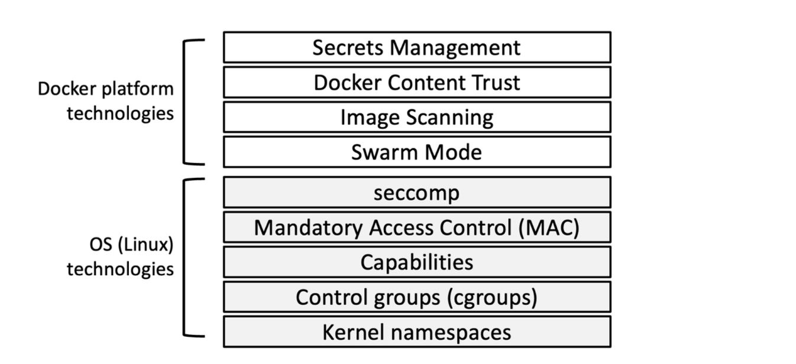

`Docker Swarm Mode` is secure by default.You get all of the following out of the box:
cryptographic node IDs, mutual authentication, automatic CA configuration, automatic
certificate rotation, encrypted cluster store, encrypted networks, and more

`Image vulnerability scanning` analyses images, detects known vulnerabilities, and
provides detailed reports and fixes.

`Docker Content Trust (DCT)` lets us sign our own images and verify the integrity and
publisher of images we consume.

`Docker secrets` let us securely share sensitive data with applications. They’re stored in
the encrypted cluster store, encrypted over the network, kept in in-memory filesystems
when in use, and operate a least-privilege model.

### Security in Docker - The deep dive

security technologies offered by the Docker platform are easy to use.

### Linux security technologies

`Namespaces`
Kernel namespaces are the main technology used to build containers.

They virtualise operating system constructs such as process trees and filesystems in the
same way that hypervisors virtualise physical resources such as CPUS and disks.

- Namespaces let us run multiple web servers, each on port 443, on a single host
  with a single OS. To do this we run each web server inside its own network
  namespace.This works because each network namespace gets its own IP address and
  full range of ports. You may have to map each one to a separate port on the Docker
  host, but each can run without being re-written or reconfigured to use a different
  port.
- We can run multiple applications, each with their own versions of shared libraries
  and configuration files. To do this, we run each application inside of its own mount
  namespace. This works because each mount namespace can have its own isolated
  copy of any directory such as /etc, /var, or /dev.

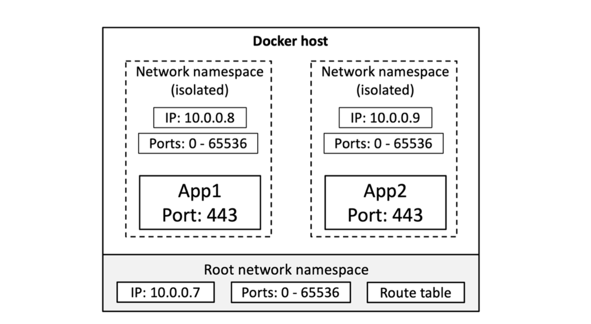

shows a high-level example of two web server applications running on a
single host and both using port 443. Each web server app is running inside of its own
network namespace.

```note
The isolation provided by namespaces isn’t strong. They need help
from some of the other technologies we’re going to mention.
```

Docker on Linux currently utilizes the following kernel namespaces:

- Process ID (pid)
- Network (net)
- Filesystem/mount (mnt)
- Inter-process Communication (ipc)
- User (user)
- UTS (uts)

containers are an organized collection of namespaces.every container has its own pid, net, mnt, ipc, uts, and possibly user namespace. In
fact, an organized collection of these namespaces is what we call a “container”.

Let’s briefly look at how Docker uses each namespace:

- `Process ID namespace`: Docker uses the pid namespace to provide isolated
  process trees for each container. This means every container gets its own PID 1.
  It also means one container cannot see or access the processes running in other
  containers. Nor can a container see or access the processes running on the host.

- `Network namespace`: Docker uses the net namespace to provide each container
  its own isolated network stack. This stack includes interfaces, IP addresses,
  port ranges, and routing tables. For example, every container gets its own eth0
  interface with its own unique IP and range of ports.

- `Mount namespace`: Every container gets its own unique isolated root (/) filesystem.
  This means every container can have its own /etc, /var, /dev and other important
  filesystem constructs. Processes inside a container cannot access the filesystems
  on the host or other containers — they can only see and access their own isolated
  filesystem.

- `Inter-process Communication namespace`: Docker uses the ipc namespace
  for shared memory access within a container. It also isolates the container from
  shared memory outside the container.

- `User namespace`: Docker lets you use user namespaces to map users inside a
  container to different users on the Linux host. A common example is mapping a
  container’s root user to a non-root user on the Linux host.

- `UTS namespace`: Docker uses the uts namespace to provide each container with
  its own hostname.

Remember, a container is a collection of namespaces that looks like a regular OS, and
Docker makes it really easy to use.

### Control Groups

If namespaces are about isolation, control groups (cgroups) are about limits.

In the real world, not the hotel analogy, containers are isolated from each other but
all share a common set of resources — things like CPU, RAM, network and disk I/O.
Cgroups let us set limits so a single container cannot consume them all and cause a
denial of service (DoS) attack

### Capabilities

It’s a bad idea to run containers as root— root is the most powerful user account on a
Linux system and therefore very dangerous.

Under the hood, the Linux root user is a combination of a long list of capabilities. Some
of these capabilities include:

- CAP_CHOWN: lets you change file ownership
- CAP_NET_BIND_SERVICE: lets you bind a socket to low numbered network ports
- CAP_SETUID: lets you elevate the privilege level of a process
- CAP_SYS_BOOT: lets you reboot the system.

Docker works with capabilities so that you can run containers as root but strip out all
the capabilities that aren’t needed.For example, if the only root capability a container
needs is the ability to bind to low numbered network ports, we start a container, drop all
root capabilities, then add back just the CAP_NET_BIND_SERVICE capability.

Docker also imposes restrictions so that
containers cannot re-add dropped capabilities.

### Mandatory Access Control systems (MAC)

Docker works with major Linux MAC technologies such as AppArmor and SELinux.

Docker also lets you start containers without policies, as well as giving you the ability
to customize policies to meet specific requirements. This is very powerful but can be
prohibitively complex.

### seccomp

Docker uses seccomp to limit the syscalls a container can make to the host’s kernel. At
the time of writing, Docker’s default seccomp profile disables 44 syscalls. Modern Linux
systems have over 300 syscalls.

### Docker security technologies

### Security in Swarm Mode

Docker Swarm allows you to cluster multiple Docker hosts and deploy applications declaratively.
Every Swarm comprises managers and workers that can be Linux or Windows.

Managers host the control plane and are responsible for configuring the cluster
and dispatching work tasks. Workers are the nodes that run application containers. As expected, swarm mode includes many security features that are enabled out-of-the-box with sensible defaults. These include:

- Cryptographic node IDs
- TLS for mutual authentication
- Secure join tokens
- CA configuration with automatic certificate rotation
- Encrypted cluster store
- Encrypted networks

### Configure a secure Swarm

Run the following command from the node you want to be the first manager in the new
swarm. We’ll run the example from mgr1.

$ docker swarm init

That’s it! That’s literally all you need to do to configure a secure swarm.

mgr1 is configured as the first manager of the swarm and also as the root certificate
authority (CA). The swarm itself has been given a cryptographic cluster ID. mgr1
has issued itself with a client certificate that identifies it as a manager, certificate
rotation has been configured with the default value of 90 days, and a cluster database
has been configured and encrypted. A set of secure tokens have also been created so
that additional managers and workers can be securely joined. All of this with a single
command!

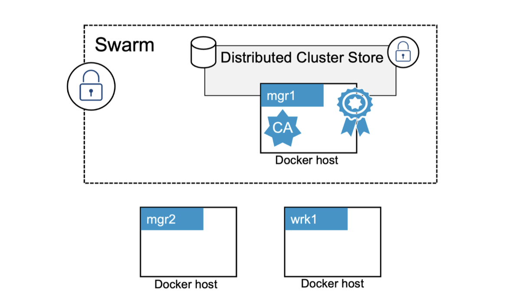

copy the token from join manager command from mgr1 and join mgr2 as additional manager

$ docker swarm join --token SWMTKN-1-1dmtwu...r17stb-2axi5...8p7glz \

This node joined a swarm as a manager.
mgr2 has joined the swarm as an additional manager.

In production clusters you should
always run either `3 or 5 managers` for high availability.

Adding a swarm worker is a similar two-step process – extract the join token and run
the command on the node.

Run another docker node ls command from either of the managers.

```note
$ docker node ls
ID HOSTNAME STATUS AVAILABILITY MANAGER STATUS
7xamk...ge662z * mgr1 Ready Active Leader
ailrd...ofzv1u wrk1 Ready Active
i0ue4...zcjm7f mgr2 Ready Active Reachable
```

We now have a swarm with two managers and one worker.

### Looking behind the scenes at Swarm security

### Swarm join tokens

The only thing that’s needed to join new managers and workers to an existing swarm is
the correct join token.

Every swarm maintains two distinct join tokens:

- One for joining new managers
- One for joining new workers

Every join token has 4 distinct fields separated by dashes (-):
PREFIX - VERSION - SWARM ID - TOKEN

The prefix is always `SWMTKN`. This allows you to `pattern-match` against it and prevent
people from accidentally posting it publicly. The `VERSION` field indicates the version of
the swarm. The `Swarm ID` field is a hash of the swarm’s certificate. The TOKEN field is
worker or manager token.

If you suspect that either of your join tokens has been compromised, you can revoke
them and issue new ones with a single command.

**manager and worker join tokens for a Swarm are identical except for the final TOKEN field.**

$ docker swarm join-token --rotate manager

Notice that the only difference between the old and new tokens is the last field. The hash
of the Swarm ID remains the same.

### TLS and mutual authentication

Every manager and worker that joins a swarm is issued a client certificate that is used
for mutual authentication.

You can inspect a node’s client certificate on Linux with the following command.

```note
$ sudo openssl x509 \
-in /var/lib/docker/swarm/certificates/swarm-node.crt \
-text
Certificate:
Data:
Version: 3 (0x2)
Serial Number:
7c:ec:1c:8f:f0:97:86:a9:1e:2f:4b:a9:0e:7f:ae:6b:7b:b7:e3:d3
Signature Algorithm: ecdsa-with-SHA256
Issuer: CN = swarm-ca
Validity
Not Before: May 23 08:23:00 2023 GMT
Not After : Aug 21 09:23:00 2023 GMT
Subject: O = tcz3w1t7yu0s4wacovn1rtgp4, OU = swarm-manager,
CN = 2gxz2h1f0rnmc3atm35qcd1zw
Subject Public Key Info:
<SNIP>
```

The Subject data in the output uses the standard O, OU, and CN fields to specify the
Swarm ID, the node’s role, and the node ID.

- The Organization (O) field stores the Swarm ID
- The Organizational Unit (OU) field stores the node’s role in the swarm
- The Canonical Name (CN) field stores the node’s crypto ID.

### Configuring some CA settings

$ docker swarm update --cert-expiry 720h

changes the certificate rotation period to 30
days.

### The cluster store

The cluster store is where swarm config and state are stored.The store is currently based on the popular etcd distributed database and is automati-
cally configured to replicate to all managers. It is also encrypted by default.

### Image vulnerability scanning

Vulnerability scanning is a major weapon against vulnerabilities and security issues in
images.

Scanners work by building a list of all software in an image and then comparing the
packages against databases of `known vulnerabilities`. Most vulnerability scanners will
rank vulnerabilities and provide advice and help on fixes.

scanning is focussed on images and doesn’t detect security problems with networks, nodes, or orchestrators.

Docker Hub offers image scanning for certain paid accounts.Docker Desktop also supports extensions that scan images.

In summary, image vulnerability scanning can be a great tool for deeply inspecting your
images for known vulnerabilities.

### Signing and verifying images with Docker Content Trust

Docker Content Trust (DCT) makes it simple and easy to verify the integrity and the publisher of images.This is especially important when pulling images over untrusted networks such as the internet.

At a high level, DCT allows developers to sign images when they are pushed to Docker
Hub or other container registries. These images can then be verified when they are
pulled and ran.

DCT can also be used to provide context whether dev, prod

you’ll need a `cryptographic key-pair` to sign images.

$ docker trust key generate nigel

If you already have a key-pair, you can import and load it with docker trust key load key.pem --name nigel.

Now that we’ve loaded a valid key-pair, we’ll associate it with the image repository we’ll
push signed images to.

```note
$ docker trust signer add --key nigel.pub nigel nigelpoulton/ddd-trust
Adding signer "nigel" to nigelpoulton/dct...
Initializing signed repository for nigelpoulton/dct...
Enter passphrase for root key with ID aee3314:
Enter passphrase for new repository key with ID 1a18dd1:
Repeat passphrase for new repository key with ID 1a18dd1:
Successfully initialized "nigelpoulton/dct"
Successfully added signer: nigel to nigelpoulton/dct
```

The following command will sign the nigelpoulton/ddd-trust:signed image and
push it to Docker Hub. You’ll need to tag an image on your system with the name of the
repo you just associated your key-pair with. I’ll push the signed image.

$ docker trust sign nigelpoulton/ddd-trust:signed

The push operation will create the repo on Docker Hub and push the image.

You can force a Docker host to always sign and verify image push and pull operations
by exporting the DOCKER_CONTENT_TRUST environment variable with a value of 1.

$ export DOCKER_CONTENT_TRUST=1

### Docker Secrets

Many applications have sensitive data such as passwords, certificates, and SSH keys.Fortunately, modern Docker installations support Docker secrets.

**Secrets require swarm as they leverage the cluster store.**

secrets are encrypted at rest, encrypted over the network, mounted into containers via in-memory filesystems, and operate a least-privilege model where they’re only made available to services that have been explicitly granted access. There’s
even a docker secret sub-command.

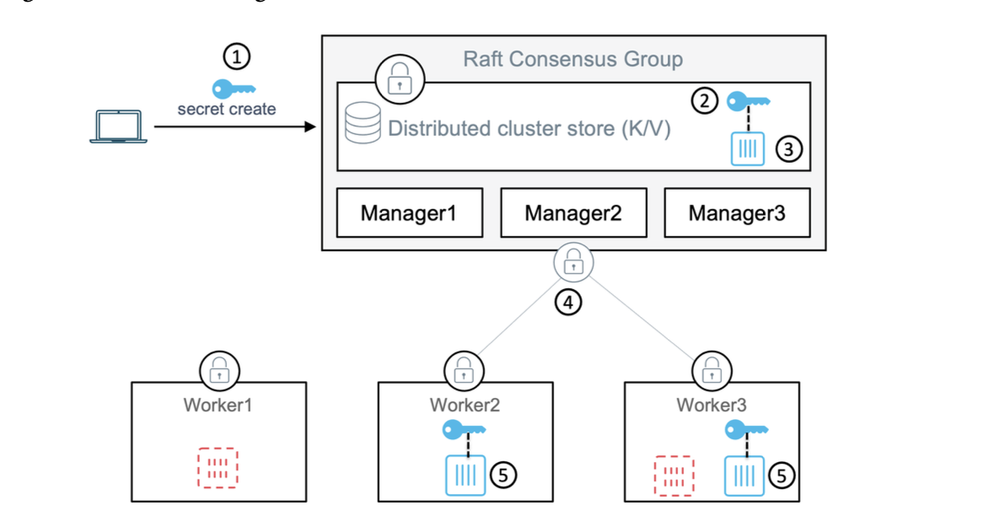

The secret is shown as the key symbol and the container icons with the dashed line are not part of the service that has access to the secret.

1. The secret is created and posted to the Swarm

2. It’s stored in the encrypted cluster store
3. The service is created and the secret is attached to it.
4. The secret is encrypted over the network while it’s delivered to service replicas
5. The secret is mounted into service replicas as an unencrypted file in an in-memory filesystem

As soon as replicas complete, the in-memory filesystem is torn down and the secret
flushed from the node.

The reason secrets are mounted in their un-encrypted form is so that applications can
use them without needing keys to decrypt them.

You can create and manage secrets with the docker secret command then attach them to services by passing the --secret flag to the docker service create command.

### Chapter Summary

It supports all of the major Linux
security technologies such as `kernel namespaces, cgroups, capabilities, MAC, and seccomp.`

Docker includes an extensive set of its own security technologies. Swarms are built on TLS and are secure out of the box. Scanning tools perform binary-level scans of images and provide detailed reports of known vulnerabilities and suggested fixes. Docker Content Trust lets you sign and
verify content, and Docker secrets allow you to securely share sensitive data with swarm
services.
